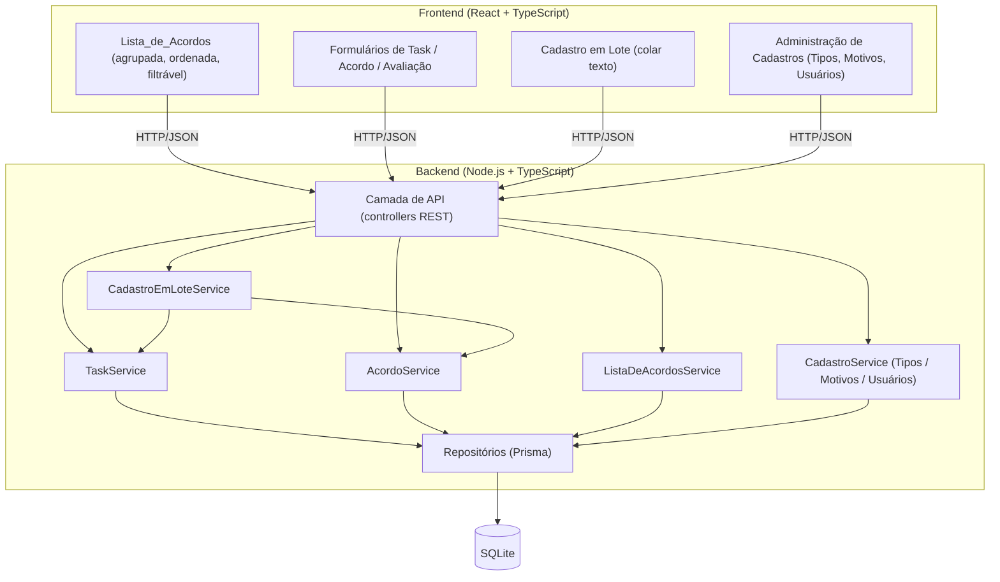

# Design Document

## Overview

O "Daily Agreements" é uma aplicação web (backend + frontend) que apoia a condução da Daily do time com base em Acordos objetivos por Task. Este MVP não integra com o Azure Boards: todas as Tasks e Acordos são gerenciados de forma independente, dentro da própria aplicação, e não há autenticação, tela de login, sessão de usuário ou controle de acesso — o Cadastro_de_Usuários serve exclusivamente para preencher o seletor de Responsável.

O núcleo do domínio é simples e determinístico: uma Task pode estar em um de dois estados de classificação (Task_Nova ou Task_Com_Acordo), possui um histórico de Acordos, e a Lista_de_Acordos é uma projeção computável desse estado (agrupamento, ordenação e filtro). Por isso, boa parte da lógica de negócio é composta de funções puras sobre o estado das Tasks/Acordos, o que torna o domínio um bom candidato para testes baseados em propriedades (property-based testing), além dos testes de unidade e integração tradicionais.

### Decisão de stack tecnológica

Os documentos de requisitos não especificam uma linguagem ou framework. Para viabilizar um MVP completo (backend + frontend + persistência) de forma simples de rodar localmente, sem infraestrutura externa, a proposta é:

- **Backend**: Node.js + TypeScript, framework HTTP leve (Express), ORM Prisma sobre SQLite (arquivo local, zero configuração de infraestrutura).
- **Frontend**: React + TypeScript (Vite), com biblioteca de drag-and-drop (`@dnd-kit`) para a reordenação manual da Lista_de_Acordos.
- **Comunicação**: API HTTP/JSON REST entre frontend e backend.

Essa escolha é uma sugestão de ponto de partida razoável para o MVP e pode ser ajustada na revisão deste design — a lógica de domínio descrita abaixo (entidades, regras, propriedades de corretude) é independente da stack escolhida.

### Nota de segurança

Por decisão explícita de escopo (ver Requisito 15.7 e o Glossário), este MVP não possui autenticação, autorização ou sessão. Isso significa que, caso a API seja exposta fora de uma rede confiável/local, qualquer pessoa com acesso à URL poderá criar, editar e remover Tasks, Acordos e cadastros. Essa é uma limitação aceita para o MVP, mas deve ser tratada como um requisito não funcional para uma fase futura antes de qualquer exposição pública.

## Architecture

A aplicação segue uma arquitetura em camadas, simples e monolítica, adequada ao escopo do MVP:



### Princípios de design

1. **Domínio como funções puras sobre estado**: as regras de classificação (Task_Nova/Task_Com_Acordo), agrupamento/ordenação/filtro da Lista_de_Acordos, e as transições de estado do Acordo (pendente → cumprido/não cumprido → substituído) são implementadas como funções puras que recebem o estado atual e retornam o novo estado (ou um erro de validação). Isso isola a lógica testável por propriedades da camada de I/O (HTTP, banco de dados).
2. **Remoção por conclusão vs. remoção manual são operações distintas**: a remoção por conclusão do Acordo "Finalizar" é uma ocultação lógica (a Task e o histórico continuam armazenados, apenas deixam de aparecer na Lista_de_Acordos), enquanto a remoção manual (Requisito 9.4) é uma exclusão física permanente da Task e de todo o seu histórico. Essa distinção é modelada explicitamente para evitar que uma implementação única de "remoção" misture os dois comportamentos.
3. **Sem estado de sessão**: todas as requisições são independentes; o "Usuário" é apenas quem opera a interface, não uma identidade autenticada.
4. **Cadastros configuráveis compartilham um padrão comum**: Cadastro_de_Tipos_de_Acordo, Cadastro_de_Motivos_de_Nao_Cumprimento e Cadastro_de_Usuários seguem a mesma forma de validação (nome/título entre 1 e N caracteres após trim, unicidade case-insensitive, semeadura inicial, bloqueio de remoção quando em uso). Esse padrão é implementado uma única vez (serviço genérico de cadastro configurável) e reaproveitado pelos três.

## Components and Interfaces

### Backend — Camada de domínio (serviços)

- **TaskService**
  - `criarTask(input)`: valida título (1–200 chars após trim), descrição opcional (≤2000 chars), Responsável opcional (deve existir no Cadastro_de_Usuários). Cria a Task com `numTentativas = 0`, `ordemExibicao` no final da lista atual, classificação implícita Task_Nova (sem Acordo_Atual).
  - `editarTask(taskId, input)`: valida e atualiza título e/ou Responsável de uma Task existente (Requisito 9).
  - `removerTask(taskId)`: exclusão física permanente da Task e de todos os seus Acordos (Requisito 9.4).
  - `reordenarTask(taskId, novaPosicao)`: recalcula `ordemExibicao` da Task movida e das demais Tasks afetadas (Requisito 14).
  - `buscarHistorico(taskId)`: retorna todos os Acordos da Task ordenados por data de registro (Requisito 7).

- **AcordoService**
  - `registrarAcordo(taskId, tipoAcordoId, responsavelId?)`: valida existência da Task, validade do Tipo_de_Acordo, e que não haja Acordo_Atual pendente de avaliação. Cria o Acordo com `dataRegistro = agora()` e `estadoCumprimento = 'pendente'`, define-o como Acordo_Atual (substituindo o anterior já avaliado, se houver) e atualiza o Responsável quando informado (Requisitos 2 e 5).
  - `avaliarAcordoAtual(taskId, resultado, motivoId?)`: valida que a Task possui Acordo_Atual; se `resultado = 'nao_cumprido'`, incrementa `numTentativas` em 1 e associa o Motivo quando válido; se `resultado = 'cumprido'` e o Tipo_de_Acordo do Acordo_Atual é "Finalizar", marca a Task como concluída (oculta da Lista_de_Acordos, histórico preservado) (Requisitos 4 e 6).

- **ListaDeAcordosService**
  - `obterLista(filtro?)`: seleciona as Tasks não removidas (nem por conclusão, nem manualmente), aplica o filtro por título/Responsável quando informado, agrupa em `taskNova[]` e `taskComAcordo[]`, ordena cada grupo por `ordemExibicao` (Requisitos 3, 8 e 13).

- **CadastroEmLoteService**
  - `processarLote(texto)`: divide o texto em linhas, processa cada linha independentemente (parse de título/Tipo_de_Acordo, validação, criação de Task + Acordo quando aplicável), preserva a ordem de exibição conforme a ordem das linhas, e retorna um relatório por linha (sucesso ou motivo da rejeição) sem interromper o processamento das demais linhas (Requisito 12).

- **CadastroService\<T\>** (genérico, reaproveitado por Tipos de Acordo, Motivos de Não Cumprimento e Usuários)
  - `listar()`: retorna todos os valores cadastrados (semeados + adicionados).
  - `adicionar(valor)`: valida trim, limite de comprimento e unicidade case-insensitive; adiciona se válido.
  - `remover(id)`: rejeita se o valor estiver em uso (referenciado por algum Acordo, no caso de Tipos/Motivos; referenciado como Responsável de alguma Task, no caso de Usuários).

### Backend — API REST (contratos)

| Método | Rota | Descrição | Requisitos |
|---|---|---|---|
| POST | `/tasks` | Cria uma Task | 1 |
| GET | `/tasks?search=` | Retorna a Lista_de_Acordos (agrupada, ordenada, filtrada) | 3, 8, 13 |
| PATCH | `/tasks/:id` | Edita título e/ou Responsável | 9.1, 9.2, 9.6, 9.7 |
| DELETE | `/tasks/:id` | Remove manualmente (exclusão física) | 9.4, 9.5 |
| PUT | `/tasks/:id/ordem` | Reordena a Task para uma nova posição | 14 |
| GET | `/tasks/:id/historico` | Retorna o histórico de Acordos da Task | 7 |
| POST | `/tasks/:id/acordos` | Registra um novo Acordo (primeiro ou próximo) | 2, 5 |
| PATCH | `/tasks/:id/acordos/atual` | Avalia o Acordo_Atual (cumprido/não cumprido + motivo opcional) | 4, 6 |
| POST | `/tasks/:id/acordos/repetir` | "Repetir último acordo": avalia o Acordo_Atual (cumprido se "Avaliar e planejar", não cumprido nos demais casos) e registra um novo Acordo do mesmo Tipo_de_Acordo, mantendo o Responsável e o indicador de alerta (Requisito 3.6) já na primeira repetição | — |
| POST | `/tasks/:id/finalizar` | "Finalizar": marca o Acordo_Atual da Task como cumprido e finaliza a atividade (`Task.concluida = true`), independentemente do Tipo_de_Acordo do Acordo_Atual | 6 |
| POST | `/tasks/lote` | Cadastro em lote a partir de texto colado | 12 |
| GET/POST | `/tipos-de-acordo` | Lista/adiciona Tipo_de_Acordo | 10 |
| DELETE | `/tipos-de-acordo/:id` | Remove Tipo_de_Acordo (se não estiver em uso) | 10.5 |
| GET/POST | `/motivos-de-nao-cumprimento` | Lista/adiciona Motivo_de_Nao_Cumprimento | 11 |
| DELETE | `/motivos-de-nao-cumprimento/:id` | Remove motivo (se não estiver em uso) | 11.5 |
| GET/POST | `/usuarios` | Lista/adiciona Usuário_Cadastrado | 15 |
| DELETE | `/usuarios/:id` | Remove Usuário_Cadastrado (se não estiver em uso como Responsável) | 15.8 |

Todas as respostas de erro seguem um formato consistente `{ "erro": { "codigo": string, "mensagem": string } }`, com código HTTP apropriado (400 para validação, 404 para recurso não encontrado, 409 para conflito/uso em outro recurso).

### Frontend — Componentes principais

- **ListaDeAcordosPage**: tela principal da Daily. Renderiza os dois grupos (Task_Nova, Task_Com_Acordo), a barra de busca (Requisito 13), e o container de drag-and-drop (Requisito 14).
- **TaskCard**: exibe título, Responsável, e — quando Task_Com_Acordo — Tipo_de_Acordo, data de registro e, se não cumprido, o indicador visual de alerta (fundo vermelho) e Nº_Tentativas (Requisito 3.6).
- **RegistrarAcordoForm**: formulário para registrar o primeiro/próximo Acordo (seleção de Tipo_de_Acordo e, opcionalmente, Responsável).
- **AvaliarAcordoForm**: ação de marcar cumprido/não cumprido, com seleção opcional de Motivo_de_Nao_Cumprimento quando não cumprido.
- **CadastroEmLotePanel**: textarea para colar múltiplas linhas + exibição do relatório de linhas aceitas/rejeitadas.
- **CadastrosAdminPage**: gerenciamento de Tipos_de_Acordo, Motivos_de_Nao_Cumprimento e Usuários (listar, adicionar, remover).
- **TaskHistoricoModal**: exibe o histórico completo de Acordos de uma Task.

## Data Models

```typescript
type EstadoCumprimento = 'pendente' | 'cumprido' | 'nao_cumprido';

interface Task {
  id: string;                     // identificador único (Requisito 1.4)
  titulo: string;                 // trim, 1–200 chars (Requisito 1.1–1.3, 9.1–9.2)
  descricao?: string;             // trim, até 2000 chars (Requisito 1.5–1.6)
  responsavelId?: string;         // referência a UsuarioCadastrado.id (Requisito 1.7–1.8)
  numTentativas: number;          // inicia em 0, só incrementa (Requisito 1.9, 4.3–4.4)
  tentativasAvaliarPlanejar: number; // ciclos consecutivos de "Avaliar e planejar" cumprido seguido de outro "Avaliar e planejar"
  repeteAcordoNaoCumprido: boolean;  // true quando o Acordo_Atual é uma repetição ("Repetir último acordo") de um Acordo não cumprido do mesmo Tipo_de_Acordo — mantém o alerta de não cumprimento visível mesmo com Acordo_Atual pendente
  ordemExibicao: number;          // posição relativa na Lista_de_Acordos (Requisito 12.8, 14)
  acordoAtualId?: string;         // null/undefined => Task_Nova; presente => Task_Com_Acordo
  concluida: boolean;             // true após Acordo "Finalizar" avaliado como cumprido (Requisito 6)
  criadaEm: string;               // ISO datetime, informativo
}

interface Acordo {
  id: string;
  taskId: string;                 // Task à qual o Acordo pertence
  tipoAcordoId: string;           // referência a TipoAcordo.id (Requisito 2.2, 5.4)
  responsavelId?: string;         // snapshot do Responsável no registro; não muda com Task.responsavelId (Requisito 7.2, 7.6)
  dataRegistro: string;           // ISO datetime, gerada pelo servidor (Requisito 2.3)
  estadoCumprimento: EstadoCumprimento;
  motivoNaoCumprimentoId?: string; // apenas quando estadoCumprimento === 'nao_cumprido' (Requisito 4.5–4.7)
}

interface TipoAcordo {
  id: string;
  nome: string;                   // único, case-insensitive, 1–100 chars após trim (Requisito 10)
}

interface MotivoNaoCumprimento {
  id: string;
  nome: string;                   // único, case-insensitive, 1–100 chars após trim (Requisito 11)
}

interface UsuarioCadastrado {
  id: string;
  nomeLogin: string;              // único, case-insensitive, 1–100 chars após trim (Requisito 15)
  // Nenhum campo de senha, sessão ou controle de acesso (Requisito 15.7)
}
```

Observações de modelagem:

- **`Task.acordoAtualId`** é a fonte de verdade da classificação Task_Nova vs. Task_Com_Acordo: `acordoAtualId` ausente ⇔ Task_Nova; presente ⇔ Task_Com_Acordo. Isso evita um campo de "status" redundante que poderia divergir do histórico real de Acordos.
- **Remoção por conclusão vs. manual**: `Task.concluida = true` implementa a remoção lógica (Requisito 6) — a Task e seus Acordos continuam no banco, apenas excluídos das consultas da Lista_de_Acordos. A remoção manual (Requisito 9.4) é um `DELETE` físico em cascata (Task + todos os Acordos), sem flag equivalente, já que não deve deixar rastro consultável.
- **Histórico** (Requisito 7) é derivado consultando todos os `Acordo` com o mesmo `taskId`, ordenados por `dataRegistro` ascendente — não é uma estrutura separada.
- **`ordemExibicao`** é um número (inteiro) reindexado nas Tasks afetadas a cada cadastro em lote ou reordenação manual, garantindo uma ordem total e estável entre apresentações da Lista_de_Acordos (Requisito 14.2).

## Correctness Properties

*A property é uma característica ou comportamento que deve se manter verdadeiro em todas as execuções válidas do sistema — essencialmente, uma afirmação formal sobre o que o sistema deve fazer. As properties servem como ponte entre as especificações legíveis por humanos (os Critérios de Aceitação) e garantias de corretude verificáveis por máquina (testes baseados em propriedades).*

### Property 1: Criação válida de Task

Para qualquer título cujo resultado do trim tenha entre 1 e 200 caracteres, criar uma Task com esse título deve produzir uma Task com título igual ao resultado do trim, `numTentativas = 0`, classificada como Task_Nova, e com um identificador que nunca coincide com o de nenhuma outra Task já criada no sistema.

**Validates: Requirements 1.1, 1.4, 1.9**

### Property 2: Rejeição de título inválido na criação

Para qualquer título cujo trim resulte em string vazia ou cujo trim exceda 200 caracteres, a criação da Task deve ser rejeitada e a lista de Tasks existente deve permanecer, em conteúdo e quantidade, inalterada.

**Validates: Requirements 1.2, 1.3**

### Property 3: Limite de comprimento da descrição

Para qualquer descrição opcional fornecida na criação de uma Task, se seu comprimento for menor ou igual a 2000 caracteres a Task deve ser criada armazenando essa descrição; se exceder 2000 caracteres, a criação deve ser rejeitada.

**Validates: Requirements 1.5, 1.6**

### Property 4: Validação de Responsável na criação

Para qualquer valor de Responsável informado na criação de uma Task, se corresponder a um Usuário_Cadastrado existente, a Task criada deve referenciá-lo como Responsável; se não corresponder a nenhum Usuário_Cadastrado existente, a criação deve ser rejeitada.

**Validates: Requirements 1.7, 1.8**

### Property 5: Primeiro Acordo reclassifica a Task

Para qualquer Task_Nova e qualquer Tipo_de_Acordo pertencente ao Cadastro_de_Tipos_de_Acordo, registrar esse Acordo para a Task deve definir esse Acordo como Acordo_Atual e reclassificar a Task como Task_Com_Acordo em qualquer apresentação subsequente da Lista_de_Acordos.

**Validates: Requirements 2.1, 8.2**

### Property 6: Tipo_de_Acordo inválido rejeita o registro

Para qualquer Tipo_de_Acordo que não pertença ao Cadastro_de_Tipos_de_Acordo, tentar registrá-lo como o primeiro ou o próximo Acordo de uma Task deve ser rejeitado, mantendo inalterado o Acordo_Atual (ou a ausência dele) da Task.

**Validates: Requirements 2.2, 5.4**

### Property 7: Operações sobre Task inexistente são rejeitadas

Para qualquer identificador que não corresponda a nenhuma Task existente, qualquer operação Task-scoped (registrar Acordo, consultar histórico, editar título/Responsável, remover, reordenar) deve ser rejeitada informando que a Task não foi encontrada, e o estado do sistema (conjunto de Tasks e Acordos existentes) deve permanecer inalterado.

**Validates: Requirements 2.4, 7.5, 9.3, 9.5, 14.3**

### Property 8: Registro de novo Acordo bloqueado com Acordo_Atual pendente

Para qualquer Task cujo Acordo_Atual ainda não tenha sido avaliado (estado `pendente`), qualquer tentativa de registrar um novo Acordo para essa Task deve ser rejeitada, mantendo o Acordo_Atual existente inalterado.

**Validates: Requirements 2.5, 5.5**

### Property 9: Task_Nova permanece sem Acordo indefinidamente

Para qualquer Task_Nova, qualquer sequência de apresentações da Lista_de_Acordos que não inclua o registro explícito de um Acordo para essa Task deve mantê-la classificada como Task_Nova, sem Acordo_Atual.

**Validates: Requirements 2.6**

### Property 10: Agrupamento exaustivo e mutuamente exclusivo

Para qualquer conjunto de Tasks não removidas (nem por conclusão, nem manualmente), a Lista_de_Acordos resultante deve particionar todas essas Tasks em exatamente dois grupos (Task_Nova e Task_Com_Acordo), sem nenhuma Task ausente ou duplicada entre os grupos, e cada grupo deve estar presente na estrutura de saída mesmo quando vazio.

**Validates: Requirements 3.2, 3.4, 8.1**

### Property 11: Campos exigidos por item da lista

Para qualquer Task_Com_Acordo, o item correspondente na Lista_de_Acordos deve conter título, Tipo_de_Acordo, data de registro do Acordo_Atual e Responsável (quando definido); para qualquer Task_Nova, o item deve conter título e Responsável (quando definido).

**Validates: Requirements 3.1, 3.3**

### Property 12: Ordenação por Ordem_de_Exibição

Para qualquer conjunto de Tasks com valores de `ordemExibicao` distintos, cada grupo (Task_Nova, Task_Com_Acordo) da Lista_de_Acordos resultante deve apresentar as Tasks em ordem não decrescente de `ordemExibicao`.

**Validates: Requirements 3.5**

### Property 13: Indicador de alerta para Acordo não cumprido

Para qualquer Task_Com_Acordo cujo Acordo_Atual esteja no estado `nao_cumprido`, ou cuja Task esteja marcada com `repeteAcordoNaoCumprido` (Acordo_Atual repetido, via "Repetir último acordo", a partir de um Acordo não cumprido do mesmo Tipo_de_Acordo), o item correspondente na Lista_de_Acordos deve conter um indicador de alerta ativo e o valor corrente de `numTentativas` dessa Task.

**Validates: Requirements 3.6**

### Property 14: Avaliação preserva o Acordo_Atual até substituição

Para qualquer Task_Com_Acordo, avaliar seu Acordo_Atual como cumprido ou como não cumprido deve alterar apenas o `estadoCumprimento` (e, se aplicável, o motivo) desse Acordo, mantendo-o como Acordo_Atual da Task até que um novo Acordo seja explicitamente registrado ou a Task seja removida.

**Validates: Requirements 4.1, 4.2, 8.3**

### Property 15: Nº_Tentativas só incrementa em não cumprido

Para qualquer Task_Com_Acordo e qualquer sequência de avaliações de seu Acordo_Atual, `numTentativas` deve incrementar em exatamente 1 a cada avaliação como não cumprido, e deve permanecer inalterado em qualquer avaliação como cumprido.

**Validates: Requirements 4.3, 4.4**

### Property 16: Tratamento do Motivo de não cumprimento

Para qualquer avaliação de um Acordo_Atual como não cumprido: se um Motivo_de_Nao_Cumprimento pertencente ao cadastro for informado, ele deve ser associado ao Acordo; se nenhum motivo for informado, o Acordo deve ser registrado como não cumprido sem motivo associado; se um motivo que não pertence ao cadastro for informado, a associação deve ser rejeitada, mas a avaliação de não cumprimento já registrada deve ser preservada.

**Validates: Requirements 4.5, 4.6, 4.7**

### Property 17: Avaliação sem Acordo_Atual é rejeitada

Para qualquer Task_Nova (sem Acordo_Atual), qualquer tentativa de avaliar cumprimento deve ser rejeitada, mantendo o estado da Task inalterado.

**Validates: Requirements 4.8**

### Property 18: Registro do próximo Acordo substitui o Acordo_Atual

Para qualquer Task cujo Acordo_Atual já tenha sido avaliado (cumprido ou não cumprido), registrar um novo Acordo válido para essa Task deve defini-lo como o novo Acordo_Atual, substituindo o anterior, independentemente do desfecho da avaliação anterior.

**Validates: Requirements 5.1, 5.2, 5.3, 7.3**

### Property 19: Histórico completo e ordenado

Para qualquer Task e qualquer sequência de registros/substituições de Acordo aplicada a ela, consultar o histórico dessa Task deve retornar exatamente todos os Acordos já registrados (incluindo o Acordo_Atual, se houver, e todos os substituídos), cada um com Tipo_de_Acordo, data de registro e estado de cumprimento, ordenados por data de registro do mais antigo para o mais recente; para uma Task sem nenhum Acordo registrado, o histórico deve ser uma lista vazia.

**Validates: Requirements 7.1, 7.2, 7.4**

### Property 20: Atualização condicional de Responsável ao registrar novo Acordo

Para qualquer registro de novo Acordo: se um Responsável válido (existente no Cadastro_de_Usuários) for informado, o Responsável atual da Task deve ser atualizado para essa referência; se nenhum Responsável for informado, o Responsável atual deve permanecer inalterado; se um Responsável inválido (não existente) for informado, o registro completo deve ser rejeitado, preservando tanto o Acordo_Atual quanto o Responsável anteriores.

**Validates: Requirements 5.6, 5.7, 5.8**

### Property 21: "Finalizar" cumprido remove permanentemente da lista preservando histórico

Para qualquer Task cujo Acordo_Atual tenha Tipo_de_Acordo "Finalizar" e seja avaliado como cumprido, essa Task não deve aparecer em nenhum grupo de nenhuma apresentação subsequente da Lista_de_Acordos, ainda que seu histórico completo de Acordos continue disponível para consulta.

**Validates: Requirements 6.1, 6.2, 6.3**

### Property 22: Edição de título

Para qualquer Task existente, editar seu título para um valor cujo trim tenha entre 1 e 200 caracteres deve atualizar o título armazenado para esse valor; editar para um valor cujo trim seja vazio ou exceda 200 caracteres deve ser rejeitado, mantendo o título anterior.

**Validates: Requirements 9.1, 9.2**

### Property 23: Remoção manual é permanente

Para qualquer Task existente, removê-la manualmente deve fazer com que essa Task e todo o seu histórico de Acordos deixem de ser retornados por qualquer consulta subsequente (Lista_de_Acordos ou histórico), diferentemente da remoção por conclusão, que preserva o histórico.

**Validates: Requirements 9.4**

### Property 24: Edição de Responsável

Para qualquer Task existente, editar seu Responsável para um valor vazio ou para um Usuário_Cadastrado existente deve atualizar o Responsável atual para esse valor (permitindo ficar sem Responsável); editar para um valor não vazio que não corresponda a nenhum Usuário_Cadastrado existente deve ser rejeitado, mantendo o Responsável anterior.

**Validates: Requirements 9.6, 9.7**

### Property 25: Inclusão em cadastro configurável

Para qualquer um dos três cadastros configuráveis (Cadastro_de_Tipos_de_Acordo, Cadastro_de_Motivos_de_Nao_Cumprimento, Cadastro_de_Usuários) e qualquer valor submetido para inclusão: se, após trim, o valor tiver entre 1 e o limite de caracteres definido para aquele cadastro e não coincidir (case-insensitive) com nenhum valor já existente, ele deve ser adicionado; caso contrário (vazio, acima do limite, ou duplicado case-insensitive), a inclusão deve ser rejeitada e o cadastro deve permanecer inalterado.

**Validates: Requirements 10.2, 10.3, 11.2, 11.3, 15.2, 15.3, 15.4, 15.5**

### Property 26: Consulta de cadastro retorna semente ∪ adicionados

Para qualquer um dos três cadastros configuráveis e qualquer sequência de inclusões válidas realizadas a partir do estado semeado inicial, consultar o cadastro deve retornar exatamente o conjunto formado pelos valores semeados mais os valores validamente adicionados, sem perdas nem duplicações.

**Validates: Requirements 10.4, 11.4, 15.6**

### Property 27: Remoção de valor em uso é rejeitada

Para qualquer Tipo_de_Acordo ou Motivo_de_Nao_Cumprimento referenciado por ao menos um Acordo existente no sistema, tentar removê-lo do respectivo cadastro deve ser rejeitado, e o valor deve permanecer no cadastro.

**Validates: Requirements 10.5, 11.5**

### Property 28: Parsing e isolamento de erros no cadastro em lote

Para qualquer bloco de texto com N linhas submetido ao cadastro em lote, o sistema deve processar as N linhas na mesma ordem em que aparecem, aplicando a cada uma, independentemente, a validação de título (mesmos limites do Requisito 1); linhas com título inválido (vazio após trim ou acima de 200 caracteres) devem ser rejeitadas individualmente, sem impedir o cadastro das demais linhas válidas do mesmo lote, e as Tasks criadas a partir das linhas válidas devem receber `ordemExibicao` consistente com a ordem relativa dessas linhas no texto original.

**Validates: Requirements 12.1, 12.3, 12.4, 12.5, 12.8**

### Property 29: Tratamento do Tipo_de_Acordo por linha do lote

Para qualquer linha do cadastro em lote que contenha o caractere ";", a parte anterior deve ser interpretada como título e a parte posterior (após trim) como Tipo_de_Acordo: se esse Tipo_de_Acordo pertencer ao Cadastro_de_Tipos_de_Acordo, a Task criada deve receber um Acordo desse tipo, ser definida como Acordo_Atual e ser classificada como Task_Com_Acordo; se não pertencer, apenas essa linha deve ser rejeitada, sem impedir o cadastro das demais linhas válidas do lote.

**Validates: Requirements 12.2, 12.6, 12.7**

### Property 30: Filtro por título ou Responsável

Para qualquer termo de busca e qualquer conjunto de Tasks ativas, a Lista_de_Acordos filtrada deve conter exatamente as Tasks cujo título contenha o termo (case-insensitive) ou cujo Responsável atual (nome/login) contenha o termo (case-insensitive), incluindo o caso em que esse conjunto é vazio.

**Validates: Requirements 13.1, 13.2, 13.3**

### Property 31: Limpar busca restaura a lista completa

Para qualquer estado de Tasks ativas, consultar a Lista_de_Acordos com termo de busca vazio deve produzir o mesmo agrupamento e ordenação que consultá-la sem nenhum termo de busca informado.

**Validates: Requirements 13.4**

### Property 32: Reordenação manual atualiza e persiste a ordem

Para qualquer conjunto de Tasks ativas e qualquer posição de destino válida, mover uma Task para essa posição deve atualizar `ordemExibicao` dela e das demais Tasks afetadas de modo a refletir a nova ordem relativa, e consultas subsequentes da Lista_de_Acordos (sem nova reordenação, cadastro em lote ou remoção) devem continuar refletindo essa mesma ordem.

**Validates: Requirements 14.1, 14.2**

## Error Handling

O tratamento de erros segue um padrão único em toda a API, para manter previsibilidade tanto para o frontend quanto para os testes:

| Categoria | Código HTTP | Exemplos | Requisitos |
|---|---|---|---|
| Validação de entrada | 400 | Título vazio/>200 chars, descrição >2000 chars, Tipo_de_Acordo/Motivo inválido, nome de cadastro vazio/>limite | 1.2, 1.3, 1.6, 2.2, 4.7, 5.4, 9.2, 10.3, 11.3, 15.3, 15.4 |
| Referência inválida | 400 | Responsável informado não existe no Cadastro_de_Usuários | 1.8, 5.8, 9.7 |
| Recurso não encontrado | 404 | Task, Acordo_Atual (para avaliação) ou valor de cadastro inexistente | 2.4, 7.5, 9.3, 9.5, 14.3 |
| Conflito de estado | 409 | Registrar Acordo com Acordo_Atual pendente; registrar primeiro Acordo em Task já Task_Com_Acordo; avaliar Task sem Acordo_Atual | 2.5, 4.8, 5.5 |
| Conflito de unicidade | 409 | Nome de cadastro (Tipo/Motivo/Usuário) já existente, case-insensitive | 10.3, 11.3, 15.5 |
| Recurso em uso | 409 | Remover Tipo_de_Acordo ou Motivo referenciado por algum Acordo | 10.5, 11.5 |

Regras gerais de tratamento de erro:

- **Nenhuma operação rejeitada altera estado**: toda validação ocorre antes de qualquer escrita persistida (transação atômica por operação), garantindo que uma rejeição nunca deixe o sistema em estado intermediário.
- **Erros são específicos e acionáveis**: cada resposta de erro identifica o campo/motivo da rejeição (ex.: "título obrigatório", "Tipo_de_Acordo inválido", "Responsável não cadastrado"), nunca uma mensagem genérica.
- **Cadastro em lote usa erro parcial, não all-or-nothing**: a resposta de `POST /tasks/lote` retorna, por linha, se foi aceita ou rejeitada e o motivo, permitindo que linhas válidas sejam processadas mesmo quando outras falham (Requisito 12.5, 12.6).
- **Erros de infraestrutura** (falha de banco de dados, etc.) são tratados como 500 e não fazem parte do escopo de teste baseado em propriedades — são cobertos por testes de integração pontuais.

## Testing Strategy

### Testes de unidade

Cobrem exemplos concretos, casos de borda específicos e comportamento determinístico não coberto por propriedades, entre eles:

- Inicialização dos três cadastros semeados (Cadastro_de_Tipos_de_Acordo, Cadastro_de_Motivos_de_Nao_Cumprimento, Cadastro_de_Usuários) com os valores exatos especificados nos Requisitos 10.1, 11.1 e 15.1.
- Geração automática da `dataRegistro` do Acordo a partir do relógio do servidor, ignorando qualquer valor enviado pelo cliente (Requisito 2.3) — usando um clock injetável/mockável.
- Ausência de campos de senha/sessão/controle de acesso no modelo de `UsuarioCadastrado` (Requisito 15.7) — verificação estrutural do schema.
- Formato e conteúdo das respostas de erro para cada categoria da tabela de Error Handling.
- Integração ponta a ponta de cada rota REST com a camada de persistência (Prisma/SQLite), usando 1–3 exemplos representativos por rota.

### Testes baseados em propriedades

Cada uma das 32 propriedades definidas na seção Correctness Properties deve ser implementada como um único teste de propriedade, usando uma biblioteca de PBT adequada à linguagem escolhida (ex.: `fast-check` para TypeScript/JavaScript). Cada teste deve:

- Executar no mínimo 100 iterações com entradas geradas aleatoriamente (títulos, descrições, Tipos_de_Acordo, Motivos, Responsáveis, sequências de operações, blocos de texto para o lote, termos de busca, permutações de ordem).
- Ser identificado com um comentário/tag no formato: **Feature: daily-agreements, Property {número}: {texto da property}**.
- Usar geradores que cubram deliberadamente os casos de borda relevantes (strings vazias/só espaços, strings no limite exato de 200/2000/100 caracteres, variações de maiúsculas/minúsculas, ausência de Responsável/Motivo, listas vazias, um único item, muitos itens).
- Operar sobre a camada de domínio (serviços/funções puras), com a camada de persistência em memória ou mockada, para manter os testes rápidos e determinísticos apesar da repetição.

Testes de propriedade e testes de unidade são complementares: os testes de propriedade garantem que os invariantes definidos nos Requisitos se mantêm para qualquer entrada válida (ou inválida, nos casos de rejeição), enquanto os testes de unidade documentam e protegem exemplos concretos e comportamentos determinísticos específicos (datas, seeds, formato de erro).
