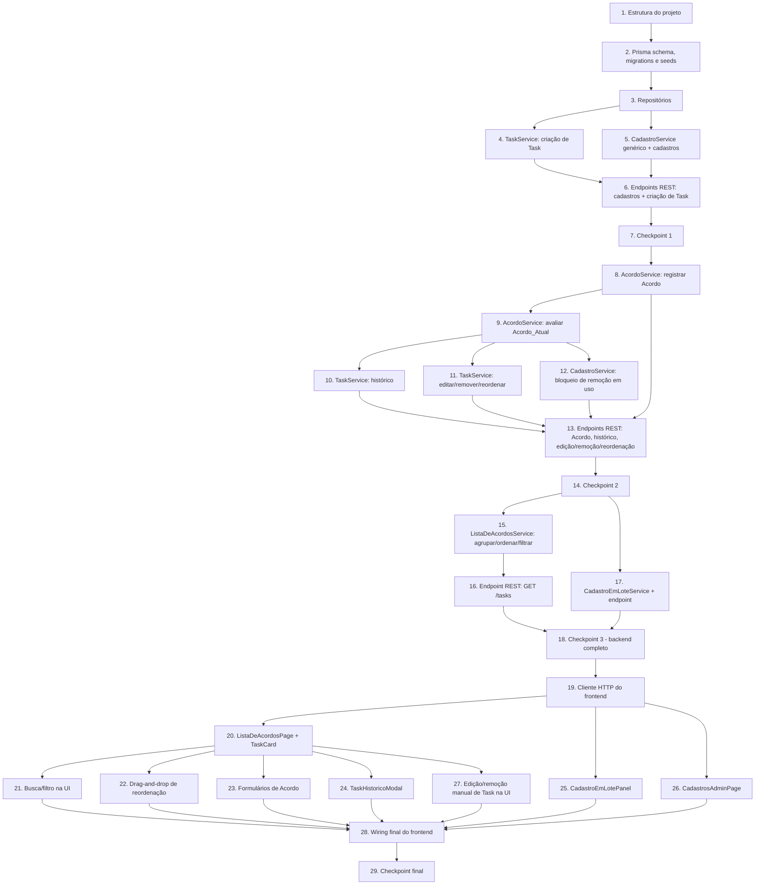

# Implementation Plan: Daily Agreements

## Overview

Este plano converte o design do "Daily Agreements" em uma sequência incremental de tarefas de codificação. O backend (Node.js + TypeScript + Express + Prisma/SQLite) é construído primeiro, camada por camada (persistência → domínio/serviços → API REST), com os testes de propriedade (fast-check) implementados junto de cada função de domínio que os valida. O frontend (React + TypeScript + Vite + `@dnd-kit`) é construído depois, consumindo a API já testada. Cada tarefa constrói sobre a anterior; não há código órfão — tudo é conectado ao fluxo da aplicação até a tarefa final de integração.

## Task Dependency Graph



```json
{
  "waves": [
    { "wave": 1, "tasks": [1] },
    { "wave": 2, "tasks": [2] },
    { "wave": 3, "tasks": [3] },
    { "wave": 4, "tasks": [4, 5] },
    { "wave": 5, "tasks": [6] },
    { "wave": 6, "tasks": [7] },
    { "wave": 7, "tasks": [8] },
    { "wave": 8, "tasks": [9] },
    { "wave": 9, "tasks": [10, 11, 12] },
    { "wave": 10, "tasks": [13] },
    { "wave": 11, "tasks": [14] },
    { "wave": 12, "tasks": [15, 17] },
    { "wave": 13, "tasks": [16] },
    { "wave": 14, "tasks": [18] },
    { "wave": 15, "tasks": [19] },
    { "wave": 16, "tasks": [20, 25, 26] },
    { "wave": 17, "tasks": [21, 22, 23, 24, 27] },
    { "wave": 18, "tasks": [28] },
    { "wave": 19, "tasks": [29] }
  ]
}
```

## Tasks

- [x] 1. Configurar estrutura do projeto (backend e frontend)
  - Criar diretórios `backend/` (Node.js + TypeScript + Express) e `frontend/` (React + TypeScript + Vite)
  - Configurar `tsconfig.json`, `package.json`, scripts de build/dev/test em ambos os pacotes
  - Instalar dependências: backend (`express`, `prisma`, `@prisma/client`, `vitest`, `fast-check`, `supertest`); frontend (`react`, `react-dom`, `@dnd-kit/core`, `@dnd-kit/sortable`, `vitest`, `@testing-library/react`)
  - Configurar linting/formatação básica consistente com o restante do projeto
  - _Requirements: N/A (infraestrutura de projeto)_

- [x] 2. Definir schema de dados, migrations e seeds (Prisma/SQLite)
  - [x] 2.1 Escrever `schema.prisma` com os modelos `Task`, `Acordo`, `TipoAcordo`, `MotivoNaoCumprimento`, `UsuarioCadastrado` conforme os Data Models do design (incluindo `acordoAtualId`, `concluida`, `numTentativas`, `ordemExibicao`)
    - Gerar e aplicar a migration inicial
    - _Requirements: 1.4, 1.9, 6.3, 9.4_
  - [x] 2.2 Implementar script de seed que popula `Cadastro_de_Tipos_de_Acordo` ("Avaliar e planejar", "Enviar para code review", "Enviar para review", "Enviar para deploy", "Finalizar"), `Cadastro_de_Motivos_de_Nao_Cumprimento` ("Dependência externa", "Requisito não previsto", "Problema ambiente", "Falta de conhecimento negócio", "Falta de conhecimento técnico") e um `Usuário_Cadastrado` semeado
    - _Requirements: 10.1, 11.1, 15.1_
  - [x] 2.3 Escrever teste de unidade validando que os três cadastros são inicializados com exatamente os valores semeados especificados
    - _Requirements: 10.1, 11.1, 15.1_

- [x] 3. Implementar camada de repositórios (Prisma)
  - [x] 3.1 Implementar `TaskRepository` (CRUD, busca por id, listagem de Tasks ativas — não concluídas e não removidas)
    - _Requirements: 1.4, 6.2, 9.4_
  - [x] 3.2 Implementar `AcordoRepository` (criar Acordo, buscar por id, buscar histórico por `taskId` ordenado por `dataRegistro`)
    - _Requirements: 7.1, 7.2, 7.3_
  - [x] 3.3 Implementar `CadastroRepository<T>` genérico reutilizável para `TipoAcordo`, `MotivoNaoCumprimento` e `UsuarioCadastrado` (listar, adicionar, remover, verificar existência case-insensitive)
    - _Requirements: 10.4, 11.4, 15.6_

- [x] 4. Implementar `TaskService` — criação de Task
  - [x] 4.1 Implementar `criarTask(input)`: valida título (trim, 1–200 chars), descrição opcional (≤2000 chars), Responsável opcional (deve existir no Cadastro_de_Usuários); inicializa `numTentativas = 0` e `ordemExibicao` no final da lista; classifica implicitamente como Task_Nova (sem `acordoAtualId`)
    - _Requirements: 1.1, 1.2, 1.3, 1.4, 1.5, 1.6, 1.7, 1.8, 1.9_
  - [x] 4.2 Escrever teste de propriedade para criação válida de Task
    - **Property 1: Criação válida de Task**
    - **Validates: Requirements 1.1, 1.4, 1.9**
  - [x] 4.3 Escrever teste de propriedade para rejeição de título inválido na criação
    - **Property 2: Rejeição de título inválido na criação**
    - **Validates: Requirements 1.2, 1.3**
  - [x] 4.4 Escrever teste de propriedade para limite de comprimento da descrição
    - **Property 3: Limite de comprimento da descrição**
    - **Validates: Requirements 1.5, 1.6**
  - [x] 4.5 Escrever teste de propriedade para validação de Responsável na criação
    - **Property 4: Validação de Responsável na criação**
    - **Validates: Requirements 1.7, 1.8**

- [x] 5. Implementar `CadastroService<T>` genérico e os três cadastros configuráveis
  - [x] 5.1 Implementar `listar()` e `adicionar(valor)` genéricos: valida trim, limite de comprimento (100 chars para Tipos/Motivos/Usuários) e unicidade case-insensitive
    - _Requirements: 10.2, 10.3, 10.4, 11.2, 11.3, 11.4, 15.2, 15.3, 15.4, 15.5, 15.6_
  - [x] 5.2 Escrever teste de propriedade para inclusão em cadastro configurável
    - **Property 25: Inclusão em cadastro configurável**
    - **Validates: Requirements 10.2, 10.3, 11.2, 11.3, 15.2, 15.3, 15.4, 15.5**
  - [x] 5.3 Escrever teste de propriedade para consulta de cadastro (semente ∪ adicionados)
    - **Property 26: Consulta de cadastro retorna semente ∪ adicionados**
    - **Validates: Requirements 10.4, 11.4, 15.6**

- [x] 6. Implementar endpoints REST: cadastros e criação de Task
  - [x] 6.1 Implementar middleware de tratamento de erros retornando `{ "erro": { "codigo": string, "mensagem": string } }` com o código HTTP apropriado (400/404/409), conforme a tabela de Error Handling do design
    - _Requirements: 1.2, 1.3, 1.6, 1.8, 10.3, 11.3, 15.3, 15.4, 15.5_
  - [x] 6.2 Implementar `GET/POST /tipos-de-acordo`, `GET/POST /motivos-de-nao-cumprimento`, `GET/POST /usuarios`
    - _Requirements: 10.2, 10.3, 10.4, 11.2, 11.3, 11.4, 15.2, 15.3, 15.4, 15.5, 15.6_
  - [x] 6.3 Implementar `POST /tasks`
    - _Requirements: 1.1, 1.2, 1.3, 1.5, 1.6, 1.7, 1.8_
  - [x] 6.4 Escrever testes de integração (1–3 exemplos por rota) cobrindo caminho feliz e erro para cada rota implementada nesta tarefa
    - _Requirements: 1.1, 1.8, 10.2, 10.3, 11.2, 15.2, 15.5_
  - [x] 6.5 Escrever teste de unidade validando o formato e conteúdo das respostas de erro para cada categoria (validação, referência inválida, conflito de unicidade)
    - _Requirements: 1.2, 1.3, 1.6, 1.8, 10.3, 11.3, 15.3, 15.4, 15.5_

- [x] 7. Checkpoint 1 — Garantir que todos os testes passam, perguntar ao usuário se houver dúvidas.

- [x] 8. Implementar `AcordoService` — registro de Acordo (primeiro e próximo)
  - [x] 8.1 Implementar `registrarAcordo(taskId, tipoAcordoId, responsavelId?)` para Task_Nova: valida existência da Task e do Tipo_de_Acordo, gera `dataRegistro` a partir de um clock injetável (não aceita valor do cliente), define o Acordo como Acordo_Atual e reclassifica a Task como Task_Com_Acordo; rejeita se já houver Acordo_Atual pendente
    - _Requirements: 2.1, 2.2, 2.3, 2.4, 2.5, 2.6_
  - [x] 8.2 Escrever teste de propriedade para o primeiro Acordo reclassificando a Task
    - **Property 5: Primeiro Acordo reclassifica a Task**
    - **Validates: Requirements 2.1, 8.2**
  - [x] 8.3 Escrever teste de propriedade para Tipo_de_Acordo inválido rejeitando o registro
    - **Property 6: Tipo_de_Acordo inválido rejeita o registro**
    - **Validates: Requirements 2.2, 5.4**
  - [x] 8.4 Escrever teste de propriedade para bloqueio de registro com Acordo_Atual pendente
    - **Property 8: Registro de novo Acordo bloqueado com Acordo_Atual pendente**
    - **Validates: Requirements 2.5, 5.5**
  - [x] 8.5 Escrever teste de propriedade para Task_Nova permanecer sem Acordo indefinidamente
    - **Property 9: Task_Nova permanece sem Acordo indefinidamente**
    - **Validates: Requirements 2.6**
  - [x] 8.6 Escrever teste de unidade para a geração automática de `dataRegistro` a partir do clock do servidor, usando um clock mockável, ignorando qualquer valor enviado pelo cliente
    - _Requirements: 2.3_
  - [x] 8.7 Estender `registrarAcordo` para o caso de "próximo Acordo": quando o Acordo_Atual da Task já foi avaliado (cumprido ou não cumprido), substituí-lo pelo novo Acordo; atualizar o Responsável somente se um valor válido for informado, rejeitando com preservação de estado se o Responsável informado for inválido
    - _Requirements: 5.1, 5.2, 5.3, 5.6, 5.7, 5.8_
  - [x] 8.8 Escrever teste de propriedade para substituição do Acordo_Atual pelo próximo Acordo
    - **Property 18: Registro do próximo Acordo substitui o Acordo_Atual**
    - **Validates: Requirements 5.1, 5.2, 5.3, 7.3**
  - [x] 8.9 Escrever teste de propriedade para atualização condicional de Responsável ao registrar novo Acordo
    - **Property 20: Atualização condicional de Responsável ao registrar novo Acordo**
    - **Validates: Requirements 5.6, 5.7, 5.8**

- [x] 9. Implementar avaliação do Acordo_Atual e remoção lógica por conclusão
  - [x] 9.1 Implementar `avaliarAcordoAtual(taskId, resultado, motivoId?)`: valida que a Task possui Acordo_Atual; ao marcar como não cumprido, incrementa `numTentativas` em 1 e associa o Motivo (quando válido) ou rejeita a associação de motivo inválido preservando a avaliação; mantém o Acordo como Acordo_Atual até substituição
    - _Requirements: 4.1, 4.2, 4.3, 4.4, 4.5, 4.6, 4.7, 4.8_
  - [x] 9.2 Escrever teste de propriedade para a avaliação preservar o Acordo_Atual até substituição
    - **Property 14: Avaliação preserva o Acordo_Atual até substituição**
    - **Validates: Requirements 4.1, 4.2, 8.3**
  - [x] 9.3 Escrever teste de propriedade para Nº_Tentativas só incrementar em não cumprido
    - **Property 15: Nº_Tentativas só incrementa em não cumprido**
    - **Validates: Requirements 4.3, 4.4**
  - [x] 9.4 Escrever teste de propriedade para o tratamento do Motivo de não cumprimento
    - **Property 16: Tratamento do Motivo de não cumprimento**
    - **Validates: Requirements 4.5, 4.6, 4.7**
  - [x] 9.5 Escrever teste de propriedade para avaliação sem Acordo_Atual ser rejeitada
    - **Property 17: Avaliação sem Acordo_Atual é rejeitada**
    - **Validates: Requirements 4.8**
  - [x] 9.6 Implementar a remoção lógica por conclusão: quando o Acordo_Atual com Tipo_de_Acordo "Finalizar" é avaliado como cumprido, marcar `Task.concluida = true`, preservando a Task e seu histórico no banco
    - _Requirements: 6.1, 6.2, 6.3_
  - [x] 9.7 Escrever teste de propriedade para "Finalizar" cumprido remover permanentemente da lista preservando histórico
    - **Property 21: "Finalizar" cumprido remove permanentemente da lista preservando histórico**
    - **Validates: Requirements 6.1, 6.2, 6.3**

- [x] 10. Implementar histórico de Acordos por Task
  - [x] 10.1 Implementar `buscarHistorico(taskId)`: retorna todos os Acordos da Task (incluindo o Acordo_Atual, quando houver) ordenados por `dataRegistro` ascendente, com Tipo_de_Acordo, data de registro e estado de cumprimento; retorna lista vazia quando não há Acordos
    - _Requirements: 7.1, 7.2, 7.4, 7.5_
  - [x] 10.2 Escrever teste de propriedade para histórico completo e ordenado
    - **Property 19: Histórico completo e ordenado**
    - **Validates: Requirements 7.1, 7.2, 7.4**

- [x] 11. Implementar edição, remoção manual e reordenação de Task
  - [x] 11.1 Implementar `editarTask(taskId, { titulo })`: valida título (trim, 1–200 chars) e atualiza; rejeita e preserva o título anterior caso inválido
    - _Requirements: 9.1, 9.2, 9.3_
  - [x] 11.2 Escrever teste de propriedade para edição de título
    - **Property 22: Edição de título**
    - **Validates: Requirements 9.1, 9.2**
  - [x] 11.3 Estender `editarTask` para edição de Responsável: aceita valor vazio (remove Responsável) ou Usuário_Cadastrado existente; rejeita e preserva o Responsável anterior caso o valor informado não seja vazio nem exista no cadastro
    - _Requirements: 9.6, 9.7_
  - [x] 11.4 Escrever teste de propriedade para edição de Responsável
    - **Property 24: Edição de Responsável**
    - **Validates: Requirements 9.6, 9.7**
  - [x] 11.5 Implementar `removerTask(taskId)`: exclusão física permanente da Task e de todos os seus Acordos associados (cascade); rejeita se a Task não existir
    - _Requirements: 9.4, 9.5_
  - [x] 11.6 Escrever teste de propriedade para remoção manual ser permanente
    - **Property 23: Remoção manual é permanente**
    - **Validates: Requirements 9.4**
  - [x] 11.7 Implementar `reordenarTask(taskId, novaPosicao)`: recalcula `ordemExibicao` da Task movida e das demais Tasks afetadas, persistindo a nova ordem; rejeita se a Task não existir
    - _Requirements: 14.1, 14.2, 14.3_
  - [x] 11.8 Escrever teste de propriedade para reordenação manual atualizar e persistir a ordem
    - **Property 32: Reordenação manual atualiza e persiste a ordem**
    - **Validates: Requirements 14.1, 14.2**
  - [x] 11.9 Escrever teste de propriedade para rejeição de operações sobre Task inexistente, cobrindo registrar Acordo, consultar histórico, editar, remover e reordenar
    - **Property 7: Operações sobre Task inexistente são rejeitadas**
    - **Validates: Requirements 2.4, 7.5, 9.3, 9.5, 14.3**

- [x] 12. Implementar bloqueio de remoção de valores de cadastro em uso
  - [x] 12.1 Estender `CadastroService.remover(id)` para Tipos_de_Acordo e Motivos_de_Nao_Cumprimento: consulta o `AcordoRepository` para verificar se o valor está referenciado por algum Acordo existente e rejeita a remoção nesse caso
    - _Requirements: 10.5, 11.5_
  - [x] 12.2 Escrever teste de propriedade para remoção de valor em uso ser rejeitada
    - **Property 27: Remoção de valor em uso é rejeitada**
    - **Validates: Requirements 10.5, 11.5**

- [x] 13. Implementar endpoints REST: Acordo, histórico, edição/remoção/reordenação de Task, e remoção de cadastros
  - [x] 13.1 Implementar `POST /tasks/:id/acordos` (primeiro/próximo Acordo) e `PATCH /tasks/:id/acordos/atual` (avaliação)
    - _Requirements: 2.1, 2.2, 2.4, 2.5, 4.1, 4.2, 4.3, 4.5, 4.6, 4.7, 4.8, 5.1, 5.2, 5.4, 5.5, 5.6, 5.7, 5.8_
  - [x] 13.2 Implementar `GET /tasks/:id/historico`, `PATCH /tasks/:id`, `DELETE /tasks/:id`, `PUT /tasks/:id/ordem`
    - _Requirements: 7.1, 7.4, 7.5, 9.1, 9.2, 9.3, 9.4, 9.5, 9.6, 9.7, 14.1, 14.3_
  - [x] 13.3 Implementar `DELETE /tipos-de-acordo/:id` e `DELETE /motivos-de-nao-cumprimento/:id`
    - _Requirements: 10.5, 11.5_
  - [x] 13.4 Escrever testes de integração (1–3 exemplos por rota) cobrindo caminho feliz e cada categoria de erro (400/404/409) para as rotas implementadas nesta tarefa
    - _Requirements: 2.4, 4.8, 5.5, 7.5, 9.5, 10.5, 11.5, 14.3_

- [x] 14. Checkpoint 2 — Garantir que todos os testes passam, perguntar ao usuário se houver dúvidas.

- [x] 15. Implementar `ListaDeAcordosService` — agrupamento, ordenação e filtro
  - [x] 15.1 Implementar `obterLista()`: seleciona Tasks não removidas (nem por conclusão, nem manualmente), particiona em `taskNova[]`/`taskComAcordo[]` (grupos sempre presentes, mesmo vazios), inclui os campos exigidos por grupo e o indicador de alerta + `numTentativas` quando o Acordo_Atual estiver não cumprido, ordenando cada grupo por `ordemExibicao`
    - _Requirements: 3.1, 3.2, 3.3, 3.4, 3.5, 3.6, 8.1, 8.3_
  - [x] 15.2 Escrever teste de propriedade para agrupamento exaustivo e mutuamente exclusivo
    - **Property 10: Agrupamento exaustivo e mutuamente exclusivo**
    - **Validates: Requirements 3.2, 3.4, 8.1**
  - [x] 15.3 Escrever teste de propriedade para campos exigidos por item da lista
    - **Property 11: Campos exigidos por item da lista**
    - **Validates: Requirements 3.1, 3.3**
  - [x] 15.4 Escrever teste de propriedade para ordenação por Ordem_de_Exibição
    - **Property 12: Ordenação por Ordem_de_Exibição**
    - **Validates: Requirements 3.5**
  - [x] 15.5 Escrever teste de propriedade para o indicador de alerta em Acordo não cumprido
    - **Property 13: Indicador de alerta para Acordo não cumprido**
    - **Validates: Requirements 3.6**
  - [x] 15.6 Estender `obterLista(filtro?)` com filtro por título ou Responsável (case-insensitive), restaurando a lista completa quando o filtro é vazio
    - _Requirements: 13.1, 13.2, 13.3, 13.4_
  - [x] 15.7 Escrever teste de propriedade para filtro por título ou Responsável
    - **Property 30: Filtro por título ou Responsável**
    - **Validates: Requirements 13.1, 13.2, 13.3**
  - [x] 15.8 Escrever teste de propriedade para limpar a busca restaurar a lista completa
    - **Property 31: Limpar busca restaura a lista completa**
    - **Validates: Requirements 13.4**

- [x] 16. Implementar endpoint REST `GET /tasks`
  - [x] 16.1 Implementar o controller consumindo `ListaDeAcordosService.obterLista(search?)` a partir do query param `search`
    - _Requirements: 3.1, 3.2, 3.3, 3.4, 3.5, 3.6, 13.1, 13.2, 13.3, 13.4_
  - [x] 16.2 Escrever testes de integração (1–3 exemplos) cobrindo lista sem filtro, com filtro sem resultados e com resultados
    - _Requirements: 3.4, 13.3_

- [x] 17. Implementar `CadastroEmLoteService` e endpoint de cadastro em lote
  - [x] 17.1 Implementar `processarLote(texto)`: divide em linhas, interpreta título/Tipo_de_Acordo separados por ";", valida cada linha independentemente (mesmos limites do Requisito 1), cria Task (+ Acordo quando aplicável) para linhas válidas preservando a ordem relativa em `ordemExibicao`, e retorna um relatório por linha (aceita ou motivo da rejeição) sem interromper o processamento das demais linhas
    - _Requirements: 12.1, 12.2, 12.3, 12.4, 12.5, 12.6, 12.7, 12.8_
  - [x] 17.2 Escrever teste de propriedade para parsing e isolamento de erros no cadastro em lote
    - **Property 28: Parsing e isolamento de erros no cadastro em lote**
    - **Validates: Requirements 12.1, 12.3, 12.4, 12.5, 12.8**
  - [x] 17.3 Escrever teste de propriedade para o tratamento do Tipo_de_Acordo por linha do lote
    - **Property 29: Tratamento do Tipo_de_Acordo por linha do lote**
    - **Validates: Requirements 12.2, 12.6, 12.7**
  - [x] 17.4 Implementar `POST /tasks/lote`
    - _Requirements: 12.1, 12.5, 12.6_
  - [x] 17.5 Escrever teste de integração (1–3 exemplos) cobrindo lote com linhas válidas e inválidas misturadas
    - _Requirements: 12.5, 12.6_

- [x] 18. Checkpoint 3 — Garantir que todos os testes do backend passam, perguntar ao usuário se houver dúvidas.

- [x] 19. Implementar cliente HTTP do frontend
  - [x] 19.1 Implementar módulo de API client com funções para todas as rotas REST do backend (tasks, acordos, histórico, lote, cadastros), tratando o formato de erro `{ "erro": { "codigo", "mensagem" } }`
    - _Requirements: N/A (infraestrutura de integração frontend-backend)_
  - [x] 19.2 Escrever testes de unidade do cliente HTTP com fetch mockado, cobrindo resposta de sucesso e resposta de erro
    - _Requirements: N/A (infraestrutura de integração frontend-backend)_

- [x] 20. Implementar `ListaDeAcordosPage` e `TaskCard`
  - [x] 20.1 Implementar `TaskCard`: exibe título, Responsável, e — quando Task_Com_Acordo — Tipo_de_Acordo, data de registro, indicador de alerta (fundo vermelho) e Nº_Tentativas quando não cumprido
    - _Requirements: 3.1, 3.3, 3.6_
  - [x] 20.2 Implementar `ListaDeAcordosPage`: consome `GET /tasks`, renderiza os dois grupos (Task_Nova, Task_Com_Acordo) incluindo estado vazio com indicação de "nenhuma Task nessa categoria"
    - _Requirements: 3.2, 3.4, 3.5_
  - [x] 20.3 Escrever testes de unidade de renderização: grupo vazio exibe indicação, grupos exibem Tasks ordenadas, `TaskCard` exibe indicador de alerta quando aplicável
    - _Requirements: 3.4, 3.5, 3.6_

- [x] 21. Implementar busca/filtro na UI
  - [x] 21.1 Implementar barra de busca na `ListaDeAcordosPage` que envia o termo para `GET /tasks?search=` e exibe indicação de "nenhuma Task encontrada" quando vazio; ao limpar o termo, recarrega a lista completa
    - _Requirements: 13.1, 13.2, 13.3, 13.4_
  - [x] 21.2 Escrever teste de unidade cobrindo busca sem resultados e limpeza da busca restaurando a lista completa
    - _Requirements: 13.3, 13.4_

- [x] 22. Implementar reordenação manual via drag-and-drop (`@dnd-kit`)
  - [x] 22.1 Implementar container de drag-and-drop na `ListaDeAcordosPage` (dentro de cada grupo) que, ao soltar uma Task em nova posição, chama `PUT /tasks/:id/ordem` e atualiza a ordem exibida
    - _Requirements: 14.1, 14.2_
  - [x] 22.2 Escrever teste de unidade simulando o evento de drop e verificando a chamada ao cliente HTTP com a nova posição
    - _Requirements: 14.1_

- [x] 23. Implementar formulários de Acordo
  - [x] 23.1 Implementar `RegistrarAcordoForm`: seleção de Tipo_de_Acordo (obrigatório) e Responsável (opcional), submetendo para `POST /tasks/:id/acordos`
    - _Requirements: 2.1, 2.2, 5.1, 5.2, 5.6, 5.7, 5.8_
  - [x] 23.2 Implementar `AvaliarAcordoForm`: ações de marcar cumprido/não cumprido, com seleção opcional de Motivo_de_Nao_Cumprimento quando não cumprido, submetendo para `PATCH /tasks/:id/acordos/atual`
    - _Requirements: 4.1, 4.2, 4.5, 4.6, 4.7_
  - [x] 23.3 Escrever testes de unidade dos formulários cobrindo submissão válida e exibição de erro retornado pela API
    - _Requirements: 2.2, 4.7, 5.4, 5.8_

- [x] 24. Implementar `TaskHistoricoModal`
  - [x] 24.1 Implementar modal que consome `GET /tasks/:id/historico` e exibe Tipo_de_Acordo, data de registro e estado de cumprimento de cada Acordo, do mais antigo ao mais recente
    - _Requirements: 7.1, 7.2, 7.4_
  - [x] 24.2 Escrever teste de unidade cobrindo histórico vazio e histórico com múltiplos Acordos
    - _Requirements: 7.4_

- [x] 25. Implementar `CadastroEmLotePanel`
  - [x] 25.1 Implementar textarea para colar múltiplas linhas, submissão para `POST /tasks/lote` e exibição do relatório por linha (aceita/rejeitada + motivo)
    - _Requirements: 12.1, 12.5, 12.6_
  - [x] 25.2 Escrever teste de unidade cobrindo submissão com linhas válidas e inválidas mescladas, verificando a exibição do relatório
    - _Requirements: 12.5, 12.6_

- [x] 26. Implementar `CadastrosAdminPage`
  - [x] 26.1 Implementar telas de listagem/adição/remoção para Tipos_de_Acordo, Motivos_de_Nao_Cumprimento e Usuários, consumindo as rotas REST correspondentes e exibindo erros de validação/uso
    - _Requirements: 10.2, 10.3, 10.4, 10.5, 11.2, 11.3, 11.4, 11.5, 15.2, 15.3, 15.4, 15.5, 15.6_
  - [x] 26.2 Escrever teste de unidade cobrindo adição rejeitada (duplicado/limite) e remoção rejeitada (valor em uso)
    - _Requirements: 10.3, 10.5, 11.3, 11.5, 15.3, 15.5_

- [x] 27. Implementar edição e remoção manual de Task na UI
  - [x] 27.1 Implementar ações de editar título/Responsável (via `TaskCard`/`ListaDeAcordosPage`) e remover Task, consumindo `PATCH /tasks/:id` e `DELETE /tasks/:id`, exibindo erros de validação quando aplicável
    - _Requirements: 9.1, 9.2, 9.6, 9.7_
  - [x] 27.2 Escrever teste de unidade cobrindo edição rejeitada (título vazio) e remoção com atualização da lista exibida
    - _Requirements: 9.2, 9.4_

- [x] 28. Wiring final do frontend
  - [x] 28.1 Configurar roteamento entre `ListaDeAcordosPage` e `CadastrosAdminPage`, garantindo que todos os componentes implementados (TaskCard, formulários, modal, painel de lote) estejam conectados à página principal
    - _Requirements: N/A (integração final)_
  - [x] 28.2 Configurar variáveis de ambiente/proxy de desenvolvimento para que o frontend consuma a API do backend localmente
    - _Requirements: N/A (integração final)_
  - [x] 28.3 Escrever teste de integração mínimo (smoke) cobrindo o fluxo: cadastrar Task → registrar Acordo → avaliar → registrar próximo Acordo, ponta a ponta contra a API real
    - _Requirements: 1.1, 2.1, 4.1, 5.1_

- [x] 29. Checkpoint final — Garantir que todos os testes (backend e frontend) passam, perguntar ao usuário se houver dúvidas.

## Notes

- Tarefas marcadas com `*` são opcionais (testes) e podem ser puladas para um MVP mais rápido; tarefas de implementação principal nunca são marcadas como opcionais.
- Cada teste de propriedade referencia exatamente uma das 32 Correctness Properties definidas no design, deve usar `fast-check`, executar no mínimo 100 iterações, e ser identificado com a tag `Feature: daily-agreements, Property {número}: {texto da property}`, conforme a seção Testing Strategy do design.
- Os testes de propriedade operam sobre a camada de domínio/serviços com persistência em memória ou mockada, mantendo-os rápidos e determinísticos.
- Os checkpoints garantem validação incremental antes de avançar para a próxima camada da aplicação.
- Todas as 15 Requisitos e as 32 Correctness Properties do design estão cobertas por pelo menos uma tarefa de implementação e, quando aplicável, por um teste de propriedade.
