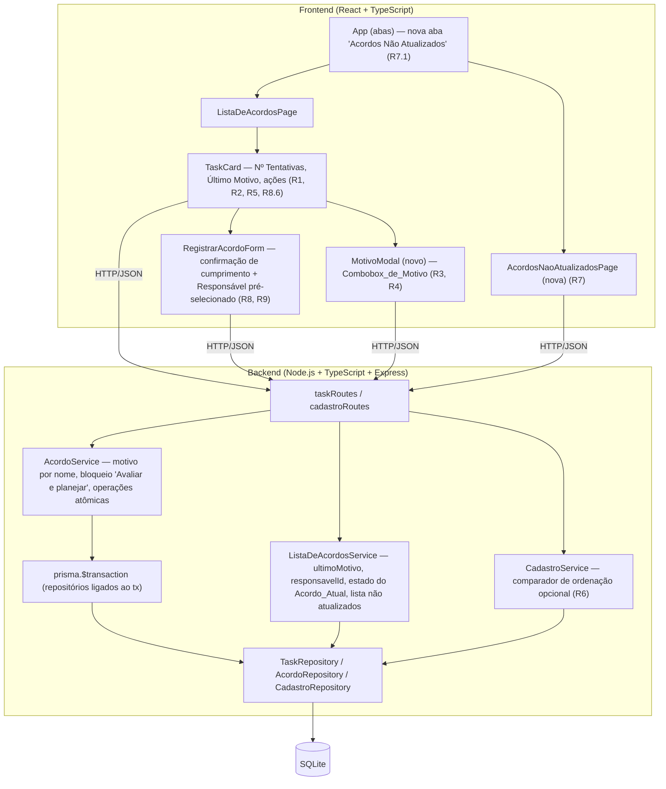
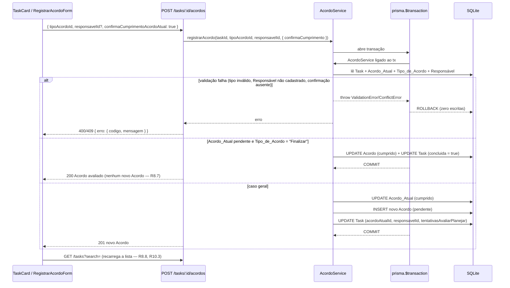
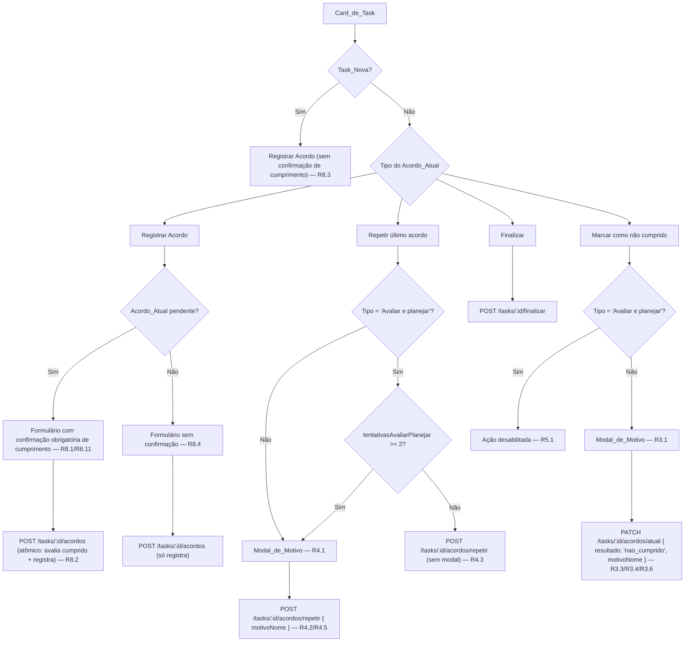

# Design Document

## Overview

Estas melhorias são incrementais sobre a aplicação "Daily Agreements" já implementada (spec base em `.kiro/specs/daily-agreements/`). Nenhuma camada nova é introduzida: o backend continua sendo Node.js + TypeScript + Express + Prisma/SQLite exposto como REST HTTP/JSON, e o frontend continua React + TypeScript (Vite). Todas as mudanças acontecem dentro dos arquivos que já existem — `AcordoService`, `ListaDeAcordosService`, `CadastroService`, `TaskRepository`, `taskRoutes`, `TaskCard`, `RegistrarAcordoForm`, `App` — mais dois artefatos novos e pequenos no frontend (um componente de modal e uma página de aba).

O conjunto de mudanças se organiza em cinco eixos:

1. **Projeção mais rica da Lista_de_Acordos** (Requisitos 1, 2, 9.5): os valores que o Card_de_Task passa a exibir (`numTentativas`, `tentativasAvaliarPlanejar`, `ultimoMotivoNome`, `responsavelId`, `estadoCumprimentoAcordoAtual`) são calculados no `ListaDeAcordosService` e transportados no item da lista — nada é derivado no frontend (Requisito 10.9).
2. **Captura do Motivo_de_Nao_Cumprimento no momento da ação** (Requisitos 3, 4): o mesmo `Acordo.motivoNaoCumprimentoId` que já existe passa a ser preenchido por um fluxo que aceita **um nome** (não só um id), resolvendo-o contra o `Cadastro_de_Motivos_de_Nao_Cumprimento` de forma case-insensitive e criando-o inline quando necessário. Sem novas tabelas, sem novas colunas.
3. **Operações combinadas atômicas** (Requisitos 4.2, 4.5, 8.2, 8.5, 10.5): "Repetir último acordo" e "Registrar Acordo com confirmação de cumprimento" avaliam o Acordo_Atual e registram o próximo em uma única transação. Hoje `AcordoService.repetirUltimoAcordo` compõe `avaliarAcordoAtual` + `registrarAcordo` em duas chamadas independentes, sem transação — esse é o gap central a fechar (ver "Atomicidade" na Architecture).
4. **Simplificação do fluxo do card** (Requisitos 5, 8): o botão "Avaliar" (e o `AvaliarAcordoForm`) deixa de existir; a confirmação de cumprimento é absorvida pelo formulário de registro, o não cumprimento passa a ser ação direta do card com Modal_de_Motivo, e Acordos de "Avaliar e planejar" não aceitam não cumprimento.
5. **Duas visões auxiliares** (Requisitos 6, 7): ordenação alfabética pt-BR do Cadastro_de_Usuários e a nova aba "Acordos Não Atualizados", que reaproveita a mesma consulta de Tasks ativas já usada pela Lista_de_Acordos.

### Pesquisa e decisões técnicas apuradas no código atual

Levantamentos feitos diretamente sobre o código, que condicionam o design:

- **Transações**: `src/db/prismaClient.ts` expõe um único `PrismaClient` compartilhado; todos os repositórios recebem o client por construtor (`constructor(prismaClient: PrismaTaskClient = prisma)`). Isso permite instanciar repositórios ligados ao client transacional (`tx`) de `prisma.$transaction(async (tx) => …)` **sem alterar os repositórios** — o `Prisma.TransactionClient` expõe exatamente os delegates de modelo que os repositórios usam (`task`, `acordo`, `tipoAcordo`, …).
- **SQLite e collation**: `CadastroRepository.existsByNameCaseInsensitive` já documenta que `mode: 'insensitive'` não é suportado pelo provider `sqlite` no Prisma; a comparação case-insensitive é feita em JS depois de carregar as linhas. A ordenação alfabética pt-BR (com acentos) segue a mesma estratégia, por consistência e por limitação real do SQLite (o único collation nativo relevante é `NOCASE`, restrito a ASCII e sem folding de acentos).
- **Comparação por dia de calendário**: `AtividadesFinalizadasService` já compara datas por dia de calendário no fuso do servidor (`mesmoDia(a, b)` via `getFullYear/getMonth/getDate`) e já usa um `Clock` injetável. A Lista_de_Acordos_Nao_Atualizados reaproveita exatamente esse padrão (Requisito 7.3).
- **Contadores já existentes**: `Task.numTentativas` (incrementado só em não cumprimento) e `Task.tentativasAvaliarPlanejar` (cadeia de "Avaliar e planejar" cumprido → "Avaliar e planejar") já são mantidos por `AcordoService`. Os Requisitos 4.6, 5.3, 8.9 e 8.10 descrevem exatamente o comportamento já implementado — o design preserva a lógica e apenas a expõe/protege.
- **`Task.repeteAcordoNaoCumprido`** já mantém o Alerta_de_Nao_Cumprimento visível na primeira repetição de um Tipo_de_Acordo diferente de "Avaliar e planejar" (Requisito 1.6). Nada muda nessa mecânica.
- **`fast-check` 3.22.0 já é devDependency do backend** e os testes de propriedade existentes rodam sobre repositórios fake em memória, com `{ numRuns: 100 }` e tag `Feature: daily-agreements, Property N: …`. As novas propriedades seguem a mesma infraestrutura.

## Architecture

A arquitetura em camadas da spec base permanece intacta. O diagrama abaixo destaca em qual componente existente cada melhoria entra (nada fora desses pontos é tocado):



### Princípios de design desta entrega

1. **Estender serviços, não criar camadas**: cada requisito é atendido por um método novo (ou um parâmetro novo) em um serviço que já existe. Não há novo serviço no backend, nem hook/store/roteador novo no frontend.
2. **Backend é a única fonte dos valores exibidos**: alertas, contadores, último motivo, estado do Acordo_Atual e identificador do Responsável chegam prontos no item da lista (Requisito 10.9). O frontend não recalcula nada disso.
3. **Zero novas colunas de domínio**: o motivo continua em `Acordo.motivoNaoCumprimentoId`; a Data_de_Ultima_Atualizacao_de_Acordo é derivada de `Acordo.dataRegistro`; o Ultimo_Motivo_Informado é derivado do histórico de Acordos.
4. **Rejeição nunca altera estado**: toda validação acontece antes de qualquer escrita e, nas operações combinadas, dentro de uma transação — inclusive a criação inline de motivo (Requisitos 5.5, 8.5, 10.5).
5. **Compatibilidade dos contratos existentes**: campos são **adicionados** aos payloads de resposta, nunca renomeados ou removidos; corpos de requisição ganham campos opcionais. Assim o Requisito 10 (preservação) é atendido por construção nas rotas não afetadas.

### Atomicidade das operações combinadas

**O gap atual.** `AcordoService.repetirUltimoAcordo` faz hoje:

```ts
await this.avaliarAcordoAtual(taskId, resultado);          // escreve Acordo + Task
return this.registrarAcordo(taskId, acordoAtual.tipoAcordoId, undefined, { … }); // escreve Acordo + Task
```

São duas operações independentes, cada uma com múltiplos `UPDATE`/`INSERT` sem transação. Se a segunda falhar (Tipo_de_Acordo removido do cadastro no meio do caminho, erro de I/O, violação de constraint), o sistema fica com o Acordo_Atual marcado não cumprido, `numTentativas` incrementado e **nenhum** Acordo novo registrado — exatamente o estado intermediário que os Requisitos 4.8 e 10.5 proíbem. O `Registro_de_Acordo_com_Avaliacao` (Requisito 8.2) tem a mesma forma e herdaria o mesmo gap, agravado pela criação inline de motivo (Requisito 5.5 exige que um motivo criado inline desapareça se a operação for rejeitada).

**Como fechar o gap sem reescrever repositórios.** `AcordoService` recebe um *transaction runner* injetável e um método privado que clona o serviço com repositórios ligados ao client transacional:

```ts
/** Executa `fn` em uma transação, entregando um AcordoService cujos repositórios usam o client transacional. */
export type TransactionRunner = <T>(fn: (svc: AcordoService) => Promise<T>) => Promise<T>;

// Runner padrão (produção): usa prisma.$transaction e reconstrói os repositórios sobre `tx`.
const prismaTransactionRunner: (svc: AcordoService) => TransactionRunner = (svc) => (fn) =>
  prisma.$transaction((tx) => fn(svc.comCliente(tx as unknown as typeof prisma)));
```

- `comCliente(client)` devolve uma nova instância de `AcordoService` com `new TaskRepository(client)` / `new AcordoRepository(client)` / `CadastroRepository` ligados ao mesmo client, preservando o `clock` e o `motivoResolver`. Os repositórios não mudam: eles **já** aceitam o client por construtor e só usam delegates de modelo, que o `Prisma.TransactionClient` expõe.
- Os métodos compostos passam a ser escritos como:

```ts
async repetirUltimoAcordo(taskId: string, motivo?: MotivoInput): Promise<Acordo> {
  return this.runTransaction(async (svc) => {
    /* validações + avaliarAcordoAtual + registrarAcordo, todos em `svc` (tx) */
  });
}
```

- Nos testes de unidade/propriedade com repositórios fake, injeta-se um runner *passthrough* (`(fn) => fn(this)`), mantendo os testes rápidos e sem banco — o mesmo padrão do `Clock` injetável já usado no serviço.
- **SQLite/Prisma**: transações interativas (`$transaction(async (tx) => …)`) são suportadas no provider `sqlite`; escritas são serializadas pelo próprio SQLite, então não há risco de deadlock entre operações concorrentes de Tasks distintas. As operações combinadas são curtas (2 `INSERT`/`UPDATE` + no máximo 1 `INSERT` de motivo), bem dentro do timeout padrão de transação interativa do Prisma.
- Uma exceção lançada dentro do callback (`ValidationError`, `ConflictError`, `NotFoundError` ou erro de infraestrutura) provoca rollback automático e propaga para o `errorHandler` sem tradução adicional — a resposta de erro continua no formato já adotado (Requisito 10.6).



### Fluxo das ações do Card_de_Task



## Components and Interfaces

### Backend — AcordoService (alterado)

**1. Resolução de Motivo_de_Nao_Cumprimento por id ou por nome (Requisitos 3.3–3.6, 3.8, 4.1)**

Novo tipo de entrada, aceito por `avaliarAcordoAtual` e por `repetirUltimoAcordo`:

```ts
/** Motivo informado pelo Combobox_de_Motivo: um id já cadastrado OU um nome (que pode ser novo). */
export interface MotivoInput {
  motivoId?: string | null;
  motivoNome?: string | null;
}
```

Regra de resolução (`private async resolverMotivo(input?: MotivoInput): Promise<string | null>`), executada **antes de qualquer escrita** e, nas operações combinadas, **dentro da transação**:

| Entrada | Resultado |
|---|---|
| `motivoId` informado e existente | usa esse id |
| `motivoId` informado e inexistente | `ValidationError MOTIVO_NAO_CUMPRIMENTO_INVALIDO` (comportamento atual, Requisito base 4.7) |
| `motivoNome` cujo trim tem 0 caracteres (ou ausente) | `null` — avaliação sem motivo (Requisito 3.6) |
| `motivoNome` cujo trim excede 100 caracteres | `ValidationError VALOR_EXCEDE_LIMITE` (Requisito 3.8) |
| `motivoNome` que coincide case-insensitive com valor do cadastro | usa o id do valor existente; cadastro inalterado em quantidade e em texto (Requisito 3.5) |
| `motivoNome` novo (1–100 caracteres após trim) | cria **exatamente 1** valor com o texto pós-trim e usa o novo id (Requisito 3.4) |

A busca case-insensitive reaproveita `CadastroRepository.findByNomeCaseInsensitive`, e a criação reaproveita as mesmas validações de `CadastroService.adicionar` (trim, limite de 100, unicidade) — mas invocadas através de um repositório ligado ao `tx` para que a criação participe do rollback (Requisito 5.5). Quando `motivoId` e `motivoNome` são informados juntos, `motivoId` tem precedência (o combobox nunca envia os dois; a regra existe para tornar o contrato determinístico).

**2. `avaliarAcordoAtual(taskId, resultado, motivo?)` (alterado)**

- Assinatura passa de `motivoId?: string | null` para `motivo?: string | MotivoInput | null`, mantendo compatibilidade com as chamadas existentes que passam um id em string.
- **Bloqueio de não cumprimento para "Avaliar e planejar"** (Requisito 5.2): quando `resultado === 'nao_cumprido'` e o `Tipo_de_Acordo.nome` do Acordo_Atual é exatamente `"Avaliar e planejar"`, rejeita com `ConflictError ACORDO_AVALIAR_PLANEJAR_NAO_CUMPRIMENTO_BLOQUEADO` **antes** de resolver o motivo — garantindo que nenhum motivo seja criado inline (Requisito 5.5) e que `estadoCumprimento`, motivo associado, `numTentativas`, `tentativasAvaliarPlanejar` e Ultimo_Motivo_Informado fiquem inalterados.
- **Motivo em avaliação cumprida** (Requisito 4.5): a associação do motivo passa a valer para os dois resultados, não só para `nao_cumprido`. Isso é necessário porque a repetição de "Avaliar e planejar" a partir da 3ª tentativa avalia o Acordo como **cumprido** e ainda assim precisa carregar o motivo informado. Quando nenhum motivo é resolvido, o campo é gravado como `null` (comportamento atual).
- O restante permanece: incremento de `numTentativas` apenas em não cumprimento (Requisito 5.3), reset de `repeteAcordoNaoCumprido` e conclusão por "Finalizar" em cumprimento.

**3. `marcarNaoCumprido(taskId, motivo?)` (novo, fino)**

Ponto de entrada da Acao_Marcar_Nao_Cumprido. Adiciona uma única regra sobre `avaliarAcordoAtual` e delega o resto:

- rejeita com `ConflictError ACORDO_ATUAL_JA_AVALIADO` quando o Acordo_Atual não está `pendente` (Requisito 3.11) e com `ConflictError SEM_ACORDO_ATUAL` quando a Task não tem Acordo_Atual (Requisito 3.11, código já existente);
- caso contrário chama `avaliarAcordoAtual(taskId, 'nao_cumprido', motivo)` dentro de uma transação (a criação inline de motivo e a atualização de `numTentativas` precisam ser tudo-ou-nada).

A exigência de estado `pendente` fica **apenas** aqui, e não em `avaliarAcordoAtual`: `repetirUltimoAcordo` e `finalizarTask` continuam podendo avaliar um Acordo_Atual já avaliado (fluxo real "marcar não cumprido → repetir último acordo"), o que evita uma regressão de comportamento não pedida por nenhum requisito.

**4. `repetirUltimoAcordo(taskId, motivo?)` (alterado, agora atômico)**

Executa dentro de uma única transação (Requisitos 4.2, 4.5, 4.8):

| Tipo_de_Acordo do Acordo_Atual | Avaliação | Motivo | Contadores |
|---|---|---|---|
| ≠ "Avaliar e planejar" | `nao_cumprido` | associado quando informado (Requisito 4.2) | `numTentativas + 1`; `tentativasAvaliarPlanejar` permanece 0 (Requisito 4.2) — quando o Acordo_Atual não é "Avaliar e planejar", esse contador já vale 0 por construção, então o reset feito pelo registro é um no-op |
| = "Avaliar e planejar" | `cumprido` | associado quando informado (Requisito 4.5) | `tentativasAvaliarPlanejar + 1`; `numTentativas` inalterado (Requisito 4.6) |

O novo Acordo é registrado com o mesmo `tipoAcordoId` e sem `responsavelId`, mantendo o Responsável atual (comportamento atual). A decisão de **abrir ou não o Modal_de_Motivo** (Requisitos 4.1, 4.3, 4.4) é do frontend, com base em `tipoAcordoNome` e `tentativasAvaliarPlanejar` já presentes no item da lista; o backend aceita `motivo` opcional em qualquer caso e nunca o exige.

**5. `registrarAcordo(taskId, tipoAcordoId, responsavelId?, options?)` (alterado)**

`options` ganha `confirmaCumprimentoAcordoAtual?: boolean`, implementando o `Registro_de_Acordo_com_Avaliacao` (Requisito 8) na **mesma rota e no mesmo método** já usados hoje:

- Acordo_Atual `pendente` **e** `confirmaCumprimentoAcordoAtual !== true` → `ValidationError CONFIRMACAO_CUMPRIMENTO_OBRIGATORIA`, com mensagem indicando que a confirmação é obrigatória e que o não cumprimento deve ser registrado pela Acao_Marcar_Nao_Cumprido (Requisito 8.11). Substitui, nesse caso, o atual `ConflictError ACORDO_ATUAL_PENDENTE`.
- Acordo_Atual `pendente` **e** confirmação `true` → transação única: avalia o Acordo_Atual como cumprido e registra o novo Acordo, sem alterar `numTentativas` (Requisito 8.2). Se o Tipo_de_Acordo do Acordo_Atual for exatamente `"Finalizar"`, a avaliação já marca `Task.concluida = true` e **nenhum novo Acordo é registrado** (Requisito 8.7).
- Acordo_Atual ausente (Task_Nova) ou já avaliado → caminho atual, inalterado, e a confirmação é ignorada quando enviada (Requisitos 8.3, 8.4).
- A cadeia de `tentativasAvaliarPlanejar` (Requisitos 8.9, 8.10) permanece exatamente como implementada hoje: como a avaliação `cumprido` ocorre antes do registro dentro da mesma transação, o incremento acontece quando o Acordo substituído era "Avaliar e planejar" cumprido e o novo também é "Avaliar e planejar"; qualquer outra combinação zera o contador.

### Backend — ListaDeAcordosService (alterado)

**1. Itens da Lista_de_Acordos com os novos campos (Requisitos 1.1, 2.1, 2.3, 8.1, 9.5, 10.9)**

```ts
export interface TaskNovaItem {
  id: string; titulo: string;
  responsavelId?: string;          // novo (Requisito 9.5)
  responsavelNome?: string; ordemExibicao: number;
}

export interface TaskComAcordoItem {
  id: string; titulo: string;
  responsavelId?: string;          // novo (Requisito 9.5)
  responsavelNome?: string; ordemExibicao: number;
  tipoAcordoNome: string;
  dataRegistroAcordoAtual: Date;
  estadoCumprimentoAcordoAtual: 'pendente' | 'cumprido' | 'nao_cumprido'; // novo (Requisitos 8.1, 8.4)
  alerta: boolean;
  numTentativas: number;                    // já existente, agora exibido sempre (Requisito 1.1)
  alertaTentativasAvaliarPlanejar: boolean;
  tentativasAvaliarPlanejar: number;        // já existente, usado também para decidir o modal (Requisito 4.4)
  ultimoMotivoNome?: string;                // novo (Requisitos 2.1, 2.3)
}
```

Todos os campos existentes são preservados com o mesmo nome e semântica; os novos são adições (Requisito 10.9 e compatibilidade do contrato).

**2. Derivação do Ultimo_Motivo_Informado (Requisitos 2.3, 2.5)**

Uma única consulta Prisma resolve todas as Tasks ativas, sem N+1: o `include` de `acordos` é filtrado para Acordos que possuem motivo, ordenado por data de registro decrescente e limitado ao primeiro:

```ts
this.prisma.task.findMany({
  where: { concluida: false },
  include: {
    acordoAtual: { include: { tipoAcordo: true } },
    responsavel: true,
    acordos: {
      where: { motivoNaoCumprimentoId: { not: null } },
      include: { motivoNaoCumprimento: true },
      orderBy: [{ dataRegistro: 'desc' }, { id: 'desc' }],
      take: 1,
    },
  },
});
```

- `ultimoMotivoNome = acordos[0]?.motivoNaoCumprimento?.nome` — ausente quando nenhum Acordo da Task tem motivo (Requisito 2.2), e independente do estado de cumprimento do Acordo_Atual (Requisito 2.6).
- **Desempate por ordem de registro** (Requisito 2.3): com `dataRegistro` idêntico, o desempate é `id` decrescente. Isso é determinístico e, na prática, corresponde à ordem de inserção, porque `Acordo.id` é gerado por `cuid()` (Prisma), cujo prefixo é um timestamp em base36 de largura fixa seguido de um contador monotônico — logo, cuids criados em sequência ordenam lexicograficamente na mesma ordem em que foram criados. A garantia forte que o requisito exige (determinismo entre duas consultas consecutivas) vale sempre; a correspondência com a ordem de inserção é uma propriedade do gerador de ids, documentada aqui para que não seja tratada como acidente.
- Uma avaliação de não cumprimento **sem** motivo grava `null` no Acordo_Atual e portanto não entra nesse filtro: o Ultimo_Motivo_Informado continua sendo o do Acordo anterior que tinha motivo (Requisito 2.5), sem nenhum tratamento especial.

**3. `obterNaoAtualizados()` — Lista_de_Acordos_Nao_Atualizados (Requisito 7)**

Novo método no mesmo serviço (não um serviço novo), com `Clock` injetável seguindo o padrão de `AtividadesFinalizadasService`:

```ts
export interface TaskNaoAtualizadaItem {
  id: string; titulo: string;
  responsavelId?: string; responsavelNome?: string;
  ordemExibicao: number;
  dataUltimaAtualizacaoAcordo?: Date;  // ausente quando a Task não tem nenhum Acordo (Requisitos 7.6, 7.10)
  tipoAcordoNome?: string;             // Tipo_de_Acordo do Acordo_Atual, quando houver (Requisito 7.6)
}
```

- Fonte: Tasks ativas (`concluida: false`; Tasks removidas manualmente já foram apagadas fisicamente) — Requisito 7.5.
- `dataUltimaAtualizacaoAcordo` = `dataRegistro` do Acordo mais recente da Task, obtido por `include: { acordos: { orderBy: [{ dataRegistro: 'desc' }, { id: 'desc' }], take: 1 } }`.
- Inclusão na lista: `dataUltimaAtualizacaoAcordo === undefined` **ou** `!mesmoDia(dataUltimaAtualizacaoAcordo, clock())`, com `mesmoDia` comparando ano/mês/dia no fuso do servidor e ignorando hora/minuto/segundo (Requisitos 7.3, 7.4). O estado de cumprimento do Acordo mais recente é irrelevante para o filtro (Requisito 7.4).
- Ordenação por `ordemExibicao` crescente, preservando a ordem relativa da Lista_de_Acordos (Requisito 7.7), e sem paginação — a resposta é a lista completa.
- `mesmoDia` é extraída para um utilitário compartilhado (`src/utils/data.ts`) e reaproveitada por `AtividadesFinalizadasService`, para que exista uma única definição de "mesmo dia de calendário" no backend.

### Backend — CadastroService (alterado): ordenação alfabética pt-BR

`CadastroServiceOptions` ganha um comparador opcional:

```ts
export interface CadastroServiceOptions<TModel, TCreateInput> {
  // … campos atuais …
  /** Comparador aplicado em `listar()`. Quando ausente, a ordem do banco é preservada (comportamento atual). */
  comparar?: (a: TModel, b: TModel) => number;
}
```

(`CadastroServiceOptions` passa a receber também o parâmetro de tipo do modelo, mudança local ao próprio `cadastroService.ts`, já que a classe `CadastroService<TModel, TCreateInput>` já é parametrizada por ele.)

Configurado **somente** para `usuarioCadastradoService` (Requisito 6.1–6.4), o que mantém `GET /tipos-de-acordo` e `GET /motivos-de-nao-cumprimento` byte-a-byte iguais ao que retornam hoje (Requisito 10.7):

```ts
const colatorPtBR = new Intl.Collator('pt-BR', { sensitivity: 'base', usage: 'sort' });

const compararUsuarios = (a: UsuarioCadastrado, b: UsuarioCadastrado) =>
  colatorPtBR.compare(a.nomeLogin, b.nomeLogin) || (a.id < b.id ? -1 : a.id > b.id ? 1 : 0);
```

**Onde ordenar: aplicação, não banco.** SQLite só oferece os collations `BINARY`, `NOCASE` e `RTRIM`; `NOCASE` cobre apenas ASCII e não faz folding de acentos, e o Prisma não suporta `mode: 'insensitive'` nem `COLLATE` customizado no provider `sqlite` (limitação já documentada em `CadastroRepository.existsByNameCaseInsensitive`). Um `ORDER BY nomeLogin COLLATE NOCASE` colocaria "Ávila" depois de "Zeca" e violaria o Requisito 6.1. `Intl.Collator('pt-BR', { sensitivity: 'base' })` resolve exatamente o pedido: ignora diferença de caixa e trata acentuados como equivalentes à letra base ("Ávila" < "Bruno", "Água" < "Alberto"), e a collation ICU para pt-BR posiciona dígitos antes de letras. As tabelas de cadastro são pequenas (dezenas de linhas), então ordenar em memória não tem custo relevante — é a mesma decisão já tomada para a comparação de unicidade.

**Desempate determinístico** (Requisito 6.2): `sensitivity: 'base'` pode considerar dois nomes equivalentes (ex.: "ana" e "Ana"); nesse caso o desempate é por `id` crescente, o que torna a sequência total e estável entre consultas consecutivas. Note que `Array.prototype.sort` é estável no V8, mas a estabilidade da *ordem de entrada* não basta aqui — a ordem devolvida pelo `findMany` sem `orderBy` não é garantida —, por isso o desempate explícito por `id`.

A quantidade de itens, os `id` e os `nomeLogin` retornados não mudam: só a sequência muda (Requisito 6.5).

### Backend — TaskRepository (alterado)

Dois métodos novos, cada um com uma única consulta Prisma; nada é removido ou alterado nos existentes:

| Método | Uso | Include |
|---|---|---|
| `listActiveWithAcordoAtualResponsavelEUltimoMotivo()` | Lista_de_Acordos (Requisitos 2.1, 2.3) | `acordoAtual.tipoAcordo`, `responsavel`, `acordos` (filtrado por motivo não nulo, `take: 1`, desc) |
| `listActiveWithUltimoAcordoEResponsavel()` | Lista_de_Acordos_Nao_Atualizados (Requisito 7.3) | `acordoAtual.tipoAcordo`, `responsavel`, `acordos` (`take: 1`, desc) |

São dois métodos porque o Prisma não permite incluir a mesma relação duas vezes com filtros diferentes na mesma consulta; manter `listActiveWithAcordoAtualEResponsavel` intacto também evita mexer nos testes que já o usam.

### Backend — Contratos REST (novos e alterados)

| Método | Rota | Mudança | Requisitos |
|---|---|---|---|
| GET | `/tasks?search=` | Itens passam a incluir `responsavelId`, `estadoCumprimentoAcordoAtual` e `ultimoMotivoNome` (quando houver); `numTentativas` e `tentativasAvaliarPlanejar` continuam presentes | 1.1, 2.1, 2.3, 8.1, 9.5, 10.9 |
| GET | `/tasks/nao-atualizados` | **Nova.** Retorna a Lista_de_Acordos_Nao_Atualizados (array, sem paginação, ordenado por Ordem_de_Exibição). Registrada como segmento literal antes das rotas `/:id`, como já é feito com `/tasks/finalizadas` | 7.2–7.7, 7.10 |
| POST | `/tasks/:id/acordos` | Body aceita `confirmaCumprimentoAcordoAtual?: boolean`. `201` + novo Acordo no caso geral; `200` + Acordo avaliado quando a confirmação concluiu uma Task de Acordo_Atual "Finalizar" (nenhum Acordo novo criado) | 8.1–8.5, 8.7, 8.9–8.11, 9.1–9.3, 9.8, 9.9 |
| PATCH | `/tasks/:id/acordos/atual` | Body aceita `motivoNome?: string` além do `motivoId?` atual. Com `resultado: 'nao_cumprido'`, delega a `marcarNaoCumprido` (exige Acordo_Atual `pendente` e bloqueia "Avaliar e planejar") | 3.3–3.6, 3.8, 3.11, 5.2, 5.3 |
| POST | `/tasks/:id/acordos/repetir` | Body opcional `{ motivoId?, motivoNome? }`; operação atômica | 4.2, 4.5, 4.6, 4.8, 4.9 |
| GET | `/usuarios` | Mesma resposta, ordenada alfabeticamente (pt-BR, case/acento-insensível, desempate por id) | 6.1, 6.2, 6.4, 6.5 |

Rotas e payloads não citados permanecem exatamente como estão (Requisito 10.1, 10.7). Nenhum campo é renomeado ou removido em nenhuma resposta.

### Frontend — Componentes

**`MotivoModal` (novo)** — implementa o Modal_de_Motivo (Requisitos 3, 4):

- Sobreposto à Lista_de_Acordos (`role="dialog"`, `aria-modal="true"`, foco inicial no Combobox_de_Motivo, `Esc` cancela).
- **Combobox_de_Motivo** = um único `<input list="motivos-…">` com `<datalist>` alimentado por `GET /motivos-de-nao-cumprimento`. Um campo só: o Usuário digita um nome novo ou escolhe um existente, inclusive quando o cadastro está vazio (Requisito 3.2). Não há dependência nova — `datalist` é nativo.
- Submete sempre `motivoNome` (texto corrente, sem trim no cliente — o trim e a resolução case-insensitive são do backend, Requisitos 3.4, 3.5). Texto vazio significa "sem motivo" (Requisito 3.6).
- Props: `titulo`, `onConfirmar(motivoNome: string): Promise<void>`, `onCancelar()`. O componente mantém o estado de `enviando`, desabilita confirmação e cancelamento enquanto a promessa está pendente (Requisitos 3.10, 4.10) e, em rejeição, mantém o modal aberto, exibe a mensagem de erro da API dentro dele e **preserva o texto digitado** (Requisitos 3.8, 3.9, 4.8, 10.4).
- Timeout de 30 s aplicado no cliente (Requisito 3.9) via `AbortController` no wrapper de fetch, traduzido para a mesma mensagem de falha de comunicação.

**`TaskCard` (alterado)**:

- Novos campos exibidos, na ordem exigida: "Registrado em" → **"Nº de tentativas"** (`numTentativas`, sempre, inclusive zero, para toda Task_Com_Acordo — Requisitos 1.1, 1.2, 1.7) → **"Último motivo informado"** (`ultimoMotivoNome`, omitido junto com o rótulo quando ausente — Requisitos 2.1, 2.2, 2.7).
- Textos dos alertas perdem o número: "Alerta: Acordo não cumprido" e "Alerta: número de tentativas de 'Avaliar e planejar' alto", sem nenhum contador embutido (Requisitos 1.4, 1.5). O `Campo_Numero_de_Tentativas` passa a ser a única origem do valor.
- Ações: `Registrar Acordo`, `Repetir último acordo`, `Finalizar` e **`Marcar como não cumprido`** (nova). O botão **`Avaliar` é removido** junto com o `AvaliarAcordoForm` (Requisito 8.6).
- `Marcar como não cumprido` fica visível e **desabilitada** (`disabled` + `aria-disabled`, com `title` explicando) quando `tipoAcordoNome === 'Avaliar e planejar'` (Requisito 5.1) e habilitada para qualquer outro tipo (Requisito 5.6). Clique em botão desabilitado não abre o modal nem dispara requisição.
- `Repetir último acordo` decide o modal localmente: abre `MotivoModal` quando `tipoAcordoNome !== 'Avaliar e planejar'` (Requisito 4.1) ou quando `tipoAcordoNome === 'Avaliar e planejar' && tentativasAvaliarPlanejar >= 2` (Requisito 4.4); caso contrário chama a API direto (Requisito 4.3). Cancelar o modal não dispara requisição nenhuma (Requisito 4.7).
- Um único estado `operacaoEmAndamento` desabilita **todas** as ações do card enquanto qualquer operação de Acordo está pendente, garantindo no máximo uma submissão por Task e imunidade a duplo-clique (Requisitos 3.10, 4.10, 10.11).
- Após sucesso: fecha modal/painel e chama `onAcordoAlterado()`, que recarrega a lista do servidor (Requisitos 4.11, 8.8, 10.3).

**`RegistrarAcordoForm` (alterado)**:

- Novas props: `estadoCumprimentoAcordoAtual?: 'pendente' | 'cumprido' | 'nao_cumprido'` e `responsavelIdAtual?: string`.
- Quando `estadoCumprimentoAcordoAtual === 'pendente'`, exibe um checkbox obrigatório "O acordo atual foi cumprido" e só habilita o submit com ele marcado; a submissão envia `confirmaCumprimentoAcordoAtual: true` (Requisitos 8.1, 8.2). Nos outros casos (Task_Nova ou Acordo_Atual já avaliado) o campo não aparece (Requisitos 8.3, 8.4).
- O Seletor_de_Responsavel inicia com `responsavelIdAtual` pré-selecionado quando esse id existe na lista carregada de `GET /usuarios`; sem correspondência (ou sem Responsável), inicia vazio (Requisitos 9.1, 9.4, 9.7). O `responsavelId` vem agora do item da lista, não de uma correspondência por nome — o casamento por `nomeLogin` que o `TaskCard` fazia na edição é substituído pelo id (Requisitos 9.5, 9.6).
- Submeter com a seleção vazia **não** envia `responsavelId`, preservando o Responsável atual (Requisito 9.8); com seleção diferente, envia o novo id (Requisito 9.3). Erro da API mantém o formulário aberto com tudo preservado (Requisitos 8.5, 9.9, 10.4).
- Lista de Usuários renderizada exatamente na ordem recebida do servidor, sem reordenar no cliente (Requisito 6.3); falha no carregamento exibe erro e deixa o seletor sem opções (Requisitos 6.7, 6.8).

**`AcordosNaoAtualizadosPage` (nova)** — consome `GET /tasks/nao-atualizados` (Requisito 7):

- Indicação de carregamento durante a requisição (Requisito 7.2); em falha ou timeout de 3 s, encerra o carregamento, mantém a aba selecionada, exibe erro e oferece botão "Tentar novamente" (Requisito 7.11).
- Cada item mostra título, Responsável (quando houver), Data_de_Ultima_Atualizacao_de_Acordo formatada em dd/mm/aaaa (quando houver) e Tipo_de_Acordo do Acordo_Atual (quando houver); Tasks sem nenhum Acordo exibem "Sem Acordo registrado" no lugar da data e do tipo (Requisitos 7.6, 7.10).
- Lista vazia exibe "Todas as Tasks ativas possuem Acordo registrado hoje" e nenhum item (Requisito 7.8).
- Os dados são recarregados a cada seleção da aba (a página monta a cada troca de aba, como `AtividadesFinalizadasPage` já faz), de forma que uma Task que recebeu Acordo hoje desaparece na próxima visita sem recarga da aplicação (Requisitos 7.9, 10.8).

**`App` (alterado)**: novo valor `'nao-atualizados'` no estado `Pagina` e a Aba_Acordos_Nao_Atualizados rotulada "Acordos Não Atualizados", posicionada entre "Lista de Acordos" e "Atividades Finalizadas", sem alterar a posição relativa das demais (Requisito 7.1). Continua sem biblioteca de roteamento.

**`src/api/client.ts` / `types.ts` (alterados)**: novos campos nos tipos de item da lista; `avaliarAcordoAtual` e `repetirUltimoAcordo` aceitam `motivoNome`; `registrarAcordo` aceita `confirmaCumprimentoAcordoAtual`; nova função `obterAcordosNaoAtualizados()`. Uma função por rota, como já é a convenção do arquivo.

## Data Models

**Nenhuma migração de banco.** `schema.prisma` permanece exatamente como está: nenhuma tabela nova, nenhuma coluna nova, nenhum índice novo obrigatório. Todos os dados adicionais exibidos são derivados do que já existe:

| Conceito novo | Derivação | Persistência |
|---|---|---|
| Motivo capturado nas modais | `Acordo.motivoNaoCumprimentoId` (campo atual), inclusive para Acordo avaliado como cumprido na repetição de "Avaliar e planejar" | existente |
| Motivo criado inline | nova linha em `MotivoNaoCumprimento` (mesmo cadastro de sempre) | existente |
| `Ultimo_Motivo_Informado` | `nome` do `MotivoNaoCumprimento` do Acordo mais recente da Task com `motivoNaoCumprimentoId != null` (desempate por `id` desc) | derivado |
| `Data_de_Ultima_Atualizacao_de_Acordo` | `dataRegistro` do Acordo mais recente da Task (desempate por `id` desc); ausente quando a Task não tem Acordos | derivado |
| `Nº_Tentativas` / `Nº_Tentativas_Avaliar_Planejar` | `Task.numTentativas` / `Task.tentativasAvaliarPlanejar` | existentes |
| `estadoCumprimentoAcordoAtual` | `Acordo.estadoCumprimento` do Acordo_Atual | derivado |
| Pertinência à Lista_de_Acordos_Nao_Atualizados | `concluida = false` e (sem Acordo **ou** dia de calendário de `dataRegistro` do último Acordo ≠ dia atual do servidor) | derivado |

Tipos de aplicação novos ou alterados (TypeScript):

```ts
// backend/src/services/acordoService.ts
/** Motivo informado pelo Combobox_de_Motivo: id existente OU nome (existente ou novo). */
export interface MotivoInput {
  motivoId?: string | null;
  motivoNome?: string | null;
}

/** Opções de `registrarAcordo`. `repeteAcordoNaoCumprido` já existe; a confirmação é nova. */
export interface RegistrarAcordoOptions {
  repeteAcordoNaoCumprido?: boolean;
  /** Requisito 8: confirma que o Acordo_Atual pendente foi cumprido, habilitando o Registro_de_Acordo_com_Avaliacao. */
  confirmaCumprimentoAcordoAtual?: boolean;
}

// backend/src/services/listaDeAcordosService.ts
export interface TaskNaoAtualizadaItem {
  id: string;
  titulo: string;
  responsavelId?: string;
  responsavelNome?: string;
  ordemExibicao: number;
  dataUltimaAtualizacaoAcordo?: Date; // ausente ⇔ Task sem nenhum Acordo registrado
  tipoAcordoNome?: string;            // Tipo_de_Acordo do Acordo_Atual, quando houver
}
```

Observações de modelagem:

- **Datas em JSON**: como já ocorre com `dataRegistroAcordoAtual` e `dataFinalizacao`, `dataUltimaAtualizacaoAcordo` é serializada como string ISO 8601 e tipada como `string` no frontend. A comparação por dia de calendário é feita **no servidor** — o cliente só formata.
- **Ausência é ausência de campo**: campos opcionais (`ultimoMotivoNome`, `responsavelId`, `dataUltimaAtualizacaoAcordo`, `tipoAcordoNome`) são omitidos quando não existem, e não enviados como `null` ou string vazia. Isso mantém a checagem no frontend igual à que já é feita com `responsavelNome` e satisfaz diretamente os Requisitos 2.2, 2.7, 7.6 e 7.10.
- **Motivo em Acordo cumprido**: `Acordo.motivoNaoCumprimentoId` passa a poder estar preenchido em um Acordo `cumprido` (Requisito 4.5). O nome da coluna continua o mesmo; a semântica passa a ser "motivo informado pelo Usuário no momento da ação", que é o que a modal captura. A derivação do Ultimo_Motivo_Informado não filtra por estado de cumprimento, então esse caso já é contemplado (Requisito 2.6).

## Correctness Properties

*Uma property é uma característica ou comportamento que deve se manter verdadeiro em todas as execuções válidas do sistema — essencialmente, uma afirmação formal sobre o que o sistema deve fazer. As properties servem como ponte entre as especificações legíveis por humanos (os Critérios de Aceitação) e garantias de corretude verificáveis por máquina (testes baseados em propriedades).*

As properties abaixo resultam da análise de testabilidade dos 93 critérios de aceitação e da consolidação de critérios logicamente redundantes (por exemplo, "novo motivo substitui o exibido" é consequência da derivação do Ultimo_Motivo_Informado; "cadastro inalterado após rejeição" é consequência da atomicidade). Critérios classificados como exemplo, borda de gerador ou verificação de não regressão aparecem na seção Testing Strategy, não aqui.

### Property 1: Renderização do Card_de_Task é fiel ao item recebido

*Para qualquer* item da Lista_de_Acordos, o Card_de_Task renderizado deve exibir exatamente os valores recebidos do servidor: para todo item de Task_Com_Acordo, o Campo_Numero_de_Tentativas com o valor inteiro íntegro de `numTentativas` (inclusive zero), imediatamente abaixo do Campo_Registrado_Em; o Campo_Ultimo_Motivo com o texto integral de `ultimoMotivoNome` imediatamente abaixo do Campo_Numero_de_Tentativas quando esse campo estiver presente, e nem campo nem rótulo quando ausente; e para todo item de Task_Nova, nenhum Campo_Numero_de_Tentativas e nenhum Campo_Ultimo_Motivo.

**Validates: Requirements 1.1, 1.2, 1.7, 2.1, 2.2, 2.7, 10.3**

### Property 2: Mensagens de alerta não contêm contadores

*Para qualquer* item de Task_Com_Acordo com `alerta` ativo e/ou `alertaTentativasAvaliarPlanejar` ativo, o texto das mensagens de alerta renderizadas não deve conter nenhum dígito, e o Card_de_Task deve continuar exibindo o indicador visual de alerta acompanhado de texto perceptível e o Campo_Numero_de_Tentativas com o valor do contador.

**Validates: Requirements 1.4, 1.5, 1.6**

### Property 3: Derivação do Ultimo_Motivo_Informado

*Para qualquer* Task e qualquer histórico de Acordos dessa Task, o `ultimoMotivoNome` informado na consulta da Lista_de_Acordos deve ser o nome do Motivo_de_Nao_Cumprimento do Acordo de data de registro mais recente entre os Acordos que possuem motivo associado — usando, em caso de datas de registro iguais, o Acordo registrado por último — e deve estar ausente quando nenhum Acordo da Task possui motivo associado, independentemente do estado de cumprimento de cada Acordo do histórico.

**Validates: Requirements 2.3, 2.4, 2.5, 2.6**

### Property 4: O item da Lista_de_Acordos carrega todos os valores exibidos

*Para qualquer* conjunto de Tasks ativas, cada item retornado pela consulta da Lista_de_Acordos deve conter o identificador do Responsável quando a Task possui Responsável (e omiti-lo quando não possui), o estado de cumprimento do Acordo_Atual, o Nº_Tentativas, o Nº_Tentativas_Avaliar_Planejar e os indicadores de alerta, de modo que nenhum valor exibido no Card_de_Task precise ser derivado no frontend.

**Validates: Requirements 9.5, 10.9**

### Property 5: O Combobox_de_Motivo oferece exatamente o cadastro

*Para qualquer* estado do Cadastro_de_Motivos_de_Nao_Cumprimento, incluindo o cadastro vazio, o conjunto de valores oferecidos para seleção no Combobox_de_Motivo deve ser exatamente o conjunto de Motivo_de_Nao_Cumprimento cadastrados, sem nenhum valor externo a esse cadastro, e o campo deve aceitar a digitação de um nome novo em qualquer um desses estados.

**Validates: Requirements 3.2**

### Property 6: Resolução do motivo e idempotência da criação inline

*Para qualquer* estado do Cadastro_de_Motivos_de_Nao_Cumprimento e qualquer valor resultante do Combobox_de_Motivo: se for um motivo já cadastrado, ele deve ser associado ao Acordo mantendo o cadastro inalterado; se for um nome cujo trim tenha de 1 a 100 caracteres e coincida, sem diferenciar maiúsculas de minúsculas, com um valor cadastrado, o valor existente deve ser associado e o cadastro deve permanecer com a mesma quantidade de valores e os mesmos textos; se for um nome cujo trim tenha de 1 a 100 caracteres e não coincida com nenhum cadastrado, exatamente 1 valor com o texto pós-trim deve ser adicionado e associado; e se o trim tiver 0 caracteres, o Acordo deve ser avaliado sem motivo associado e o cadastro deve permanecer inalterado.

**Validates: Requirements 3.3, 3.4, 3.5, 3.6, 10.7**

### Property 7: Nome de motivo acima do limite é rejeitado sem efeito

*Para qualquer* nome de Motivo_de_Nao_Cumprimento cujo comprimento após trim exceda 100 caracteres, a operação que o recebe deve ser rejeitada com erro de validação indicando o limite máximo, mantendo o Cadastro_de_Motivos_de_Nao_Cumprimento com a mesma quantidade de valores e o Acordo_Atual, o Nº_Tentativas e o Nº_Tentativas_Avaliar_Planejar da Task inalterados.

**Validates: Requirements 3.8**

### Property 8: Contadores são monotônicos e mutuamente exclusivos

*Para qualquer* Task e qualquer sequência de operações de Acordo aplicada a ela, cada avaliação de não cumprimento aceita deve incrementar o Nº_Tentativas em exatamente 1 e manter o Nº_Tentativas_Avaliar_Planejar inalterado, e cada repetição aceita de um Acordo_Atual de Tipo_de_Acordo "Avaliar e planejar" deve incrementar o Nº_Tentativas_Avaliar_Planejar em exatamente 1 e manter o Nº_Tentativas inalterado — de modo que nenhuma operação aceita decremente o Nº_Tentativas e nenhuma operação incremente os dois contadores simultaneamente.

**Validates: Requirements 1.3, 4.6, 5.3**

### Property 9: Não cumprimento é bloqueado para "Avaliar e planejar"

*Para qualquer* Task cujo Acordo_Atual tenha Tipo_de_Acordo "Avaliar e planejar" e qualquer valor de Combobox_de_Motivo, inclusive um nome destinado a criação inline, a submissão de uma avaliação de não cumprimento deve ser rejeitada antes de qualquer escrita, mantendo o estado de cumprimento e o motivo associado do Acordo_Atual, o Nº_Tentativas, o Nº_Tentativas_Avaliar_Planejar, o Ultimo_Motivo_Informado e o Cadastro_de_Motivos_de_Nao_Cumprimento exatamente iguais aos de antes da submissão.

**Validates: Requirements 5.2, 5.5**

### Property 10: Operações que exigem Acordo_Atual pendente são rejeitadas sem efeito

*Para qualquer* Task que não possua Acordo_Atual, e para qualquer Task cujo Acordo_Atual já tenha sido avaliado como cumprido ou como não cumprido, a submissão de uma avaliação de não cumprimento deve ser rejeitada; e para qualquer Task que não possua Acordo_Atual, a repetição do último Acordo deve ser rejeitada — em todos os casos com o Acordo_Atual (ou sua ausência), o Nº_Tentativas, o Nº_Tentativas_Avaliar_Planejar e o Cadastro_de_Motivos_de_Nao_Cumprimento inalterados.

**Validates: Requirements 3.11, 4.9**

### Property 11: Repetição do último Acordo é uma operação única e completa

*Para qualquer* Task com Acordo_Atual e qualquer valor de Combobox_de_Motivo, a repetição aceita do último Acordo deve produzir, em uma única operação: quando o Tipo_de_Acordo do Acordo_Atual é diferente de "Avaliar e planejar", o Acordo_Atual anterior avaliado como não cumprido com o motivo resultante associado quando houver; quando o Tipo_de_Acordo é "Avaliar e planejar", o Acordo_Atual anterior avaliado como cumprido com o motivo resultante associado quando houver; e, em ambos os casos, um novo Acordo do mesmo Tipo_de_Acordo como Acordo_Atual, com o Responsável da Task inalterado.

**Validates: Requirements 4.2, 4.3, 4.5**

### Property 12: Decisão de apresentar o Modal_de_Motivo na repetição

*Para qualquer* item de Task_Com_Acordo, o acionamento da Acao_Repetir_Ultimo_Acordo deve apresentar o Modal_de_Motivo, sem submeter nenhuma requisição, exatamente quando o Tipo_de_Acordo do Acordo_Atual for diferente de "Avaliar e planejar" ou quando o Nº_Tentativas_Avaliar_Planejar informado for maior ou igual a 2; e deve submeter a repetição diretamente, sem apresentar o Modal_de_Motivo, em qualquer outro caso.

**Validates: Requirements 4.1, 4.4**

### Property 13: Atomicidade — rejeição implica estado inalterado

*Para qualquer* operação combinada de avaliação e registro (repetição do último Acordo ou registro de Acordo com avaliação embutida) e *para qualquer* etapa dessa operação que seja rejeitada, o estado observável após a rejeição deve ser idêntico ao estado imediatamente anterior à submissão: o mesmo Acordo_Atual com o mesmo estado de cumprimento e o mesmo motivo associado, o mesmo Nº_Tentativas, o mesmo Nº_Tentativas_Avaliar_Planejar, o mesmo Responsável, o mesmo histórico de Acordos e o mesmo Cadastro_de_Motivos_de_Nao_Cumprimento, incluindo a ausência de qualquer valor que essa operação tenha tentado criar inline.

**Validates: Requirements 3.9, 4.8, 8.5, 10.5**

### Property 14: Registro de Acordo com avaliação embutida

*Para qualquer* Task e qualquer Tipo_de_Acordo pertencente ao Cadastro_de_Tipos_de_Acordo, o registro aceito de um novo Acordo deve: quando o Acordo_Atual estava pendente e a confirmação de cumprimento foi informada, avaliar esse Acordo_Atual como cumprido e definir o novo Acordo como Acordo_Atual em uma única operação, mantendo o Nº_Tentativas inalterado — exceto quando o Tipo_de_Acordo do Acordo_Atual for "Finalizar", caso em que a Task deve ser marcada como concluída e nenhum novo Acordo deve ser registrado; e, quando o Acordo_Atual estava ausente ou já avaliado, registrar o novo Acordo mantendo inalterados o estado de cumprimento do Acordo_Atual anterior e o Nº_Tentativas.

**Validates: Requirements 8.2, 8.4, 8.7**

### Property 15: Confirmação de cumprimento é obrigatória com Acordo_Atual pendente

*Para qualquer* Task cujo Acordo_Atual esteja pendente de avaliação e qualquer Tipo_de_Acordo válido, o registro de um novo Acordo submetido sem a confirmação de que o Acordo_Atual foi cumprido deve ser rejeitado com erro de validação, mantendo o Acordo_Atual, o seu estado de cumprimento, o Nº_Tentativas, o Nº_Tentativas_Avaliar_Planejar e o Responsável da Task inalterados.

**Validates: Requirements 8.11**

### Property 16: Forma do formulário de registro depende do estado do Acordo_Atual

*Para qualquer* item da Lista_de_Acordos, o formulário de registro de Acordo apresentado deve conter o campo obrigatório de confirmação de cumprimento exatamente quando o item for de Task_Com_Acordo com Acordo_Atual pendente, e não conter esse campo quando o item for de Task_Nova ou de Task_Com_Acordo com Acordo_Atual já avaliado, sem submeter nenhuma requisição até a submissão do formulário.

**Validates: Requirements 8.1, 8.3**

### Property 17: Cadeia de ciclos de "Avaliar e planejar"

*Para qualquer* Task e qualquer sequência de registros de Acordo aplicada a ela, o Nº_Tentativas_Avaliar_Planejar após a sequência deve ser igual ao comprimento da cadeia final de registros consecutivos em que o Acordo_Atual substituído era de Tipo_de_Acordo "Avaliar e planejar" avaliado como cumprido e o novo Acordo também era de Tipo_de_Acordo "Avaliar e planejar", sendo zero quando o último registro rompeu essa cadeia.

**Validates: Requirements 8.9, 8.10**

### Property 18: Disponibilidade das ações do Card_de_Task

*Para qualquer* item da Lista_de_Acordos, o Card_de_Task renderizado deve oferecer as ações "Registrar Acordo", "Repetir último acordo" e "Finalizar" acionáveis para todo item de Task_Com_Acordo, apresentar a Acao_Marcar_Nao_Cumprido visível e desabilitada exatamente quando o Tipo_de_Acordo do Acordo_Atual for "Avaliar e planejar" e habilitada para qualquer outro Tipo_de_Acordo, e não oferecer nenhuma ação de avaliação isolada de cumprimento.

**Validates: Requirements 5.1, 5.4, 5.6, 8.6**

### Property 19: Ordenação total e determinística do Cadastro_de_Usuários

*Para qualquer* conjunto de Usuário_Cadastrado, a sequência retornada pela consulta do Cadastro_de_Usuários deve ser não decrescente segundo a comparação de nome/login que ignora diferença de maiúsculas e minúsculas, trata caracteres acentuados como equivalentes à letra base em português do Brasil e posiciona valores iniciados por dígito antes de valores iniciados por letra, com desempate crescente por identificador; deve conter exatamente os mesmos identificadores e nomes/logins do conjunto de entrada, sem perdas nem duplicações; e duas consultas consecutivas sem alteração no cadastro devem retornar a mesma sequência.

**Validates: Requirements 6.1, 6.2, 6.4, 6.5**

### Property 20: O cliente preserva a ordem recebida do servidor

*Para qualquer* sequência de Usuário_Cadastrado retornada pelo servidor, incluindo a sequência vazia, todo Seletor_de_Responsavel e a listagem do Cadastro_de_Usuários na tela de Administração de Cadastros devem apresentar exatamente essa sequência, sem reordenar, omitir, truncar ou duplicar itens.

**Validates: Requirements 6.3, 6.6, 6.7**

### Property 21: Partição exata da Lista_de_Acordos_Nao_Atualizados

*Para qualquer* conjunto de Tasks e qualquer Data_Atual, a Lista_de_Acordos_Nao_Atualizados retornada deve conter exatamente as Tasks ativas que não possuem nenhum Acordo registrado somadas às Tasks ativas cuja data de registro do Acordo mais recente pertença a um dia de calendário diferente da Data_Atual, excluindo toda Task concluída e toda Task ativa cujo Acordo mais recente tenha sido registrado no dia de calendário da Data_Atual — independentemente do estado de cumprimento desse Acordo —, apresentada em ordem não decrescente de Ordem_de_Exibição e sem paginação.

**Validates: Requirements 7.3, 7.4, 7.5, 7.7, 7.9**

### Property 22: Renderização do item de Acordo Não Atualizado

*Para qualquer* item da Lista_de_Acordos_Nao_Atualizados, a apresentação deve exibir o título, o Responsável quando informado, a Data_de_Ultima_Atualizacao_de_Acordo com dia, mês e ano quando informada e o Tipo_de_Acordo do Acordo_Atual quando informado, omitindo cada campo cujo valor não exista e substituindo data e Tipo_de_Acordo por uma indicação de ausência de Acordo registrado quando ambos estiverem ausentes.

**Validates: Requirements 7.6, 7.10**

### Property 23: Pré-seleção do Responsável nos formulários

*Para qualquer* Task e qualquer estado do Cadastro_de_Usuários, o Seletor_de_Responsavel apresentado no formulário de registro de Acordo e no formulário de edição de Task deve iniciar com o Usuário_Cadastrado correspondente ao identificador de Responsável da Task quando esse identificador pertencer ao Cadastro_de_Usuários, e iniciar sem nenhum Usuário_Cadastrado selecionado quando a Task não possuir Responsável ou quando o identificador não pertencer ao Cadastro_de_Usuários, permitindo em ambos os casos a submissão do formulário nesse estado inicial.

**Validates: Requirements 9.1, 9.4, 9.6, 9.7**

### Property 24: Atualização condicional do Responsável no registro de Acordo

*Para qualquer* registro de Acordo, se um Responsável pertencente ao Cadastro_de_Usuários for informado, o Responsável da Task deve passar a ser exatamente esse Usuário_Cadastrado; se nenhum Responsável for informado, o Responsável atual da Task deve permanecer inalterado; e se um Responsável que não pertence ao Cadastro_de_Usuários for informado, o registro completo deve ser rejeitado, preservando o Acordo_Atual e o Responsável anteriores.

**Validates: Requirements 9.2, 9.3, 9.8, 9.9**

## Error Handling

O formato de resposta de erro não muda: `{ "erro": { "codigo": string, "mensagem": string } }`, produzido pelo `errorHandler` existente a partir de `ValidationError` (400), `NotFoundError` (404) e `ConflictError` (409) (Requisito 10.6). Nenhuma classe de erro nova é criada — as três existentes cobrem todos os casos novos.

| Categoria | HTTP | Classe | Código | Quando | Requisitos |
|---|---|---|---|---|---|
| Validação de entrada | 400 | `ValidationError` | `VALOR_EXCEDE_LIMITE` (reutilizado de `CadastroService`) | nome de motivo com trim acima de 100 caracteres | 3.8 |
| Validação de entrada | 400 | `ValidationError` | `MOTIVO_NAO_CUMPRIMENTO_INVALIDO` (existente) | `motivoId` informado que não pertence ao cadastro | base 4.7 |
| Validação de entrada | 400 | `ValidationError` | `CONFIRMACAO_CUMPRIMENTO_OBRIGATORIA` (novo) | registro de Acordo com Acordo_Atual pendente e sem confirmação de cumprimento | 8.11 |
| Referência inválida | 400 | `ValidationError` | `RESPONSAVEL_NAO_CADASTRADO` (existente) | Responsável selecionado não pertence ao Cadastro_de_Usuários | 9.9 |
| Recurso não encontrado | 404 | `NotFoundError` | `TASK_NAO_ENCONTRADA` (existente) | operação sobre Task inexistente | 3.11, 4.9 |
| Conflito de estado | 409 | `ConflictError` | `SEM_ACORDO_ATUAL` (existente) | avaliação ou repetição em Task sem Acordo_Atual | 3.11, 4.9 |
| Conflito de estado | 409 | `ConflictError` | `ACORDO_ATUAL_JA_AVALIADO` (novo) | Acao_Marcar_Nao_Cumprido em Acordo_Atual já avaliado | 3.11 |
| Conflito de estado | 409 | `ConflictError` | `ACORDO_AVALIAR_PLANEJAR_NAO_CUMPRIMENTO_BLOQUEADO` (novo) | avaliação de não cumprimento em Acordo_Atual de Tipo_de_Acordo "Avaliar e planejar" | 5.2 |
| Conflito de unicidade | 409 | `ConflictError` | `VALOR_DUPLICADO` (existente) | nunca ocorre na criação inline (a coincidência case-insensitive reaproveita o valor existente antes de tentar criar); permanece válido para inclusão manual no cadastro | 10.7 |

Regras adicionais desta entrega:

- **Ordem de verificação**: existência da Task → existência/estado do Acordo_Atual → bloqueio por Tipo_de_Acordo → confirmação de cumprimento → validade do Responsável → resolução/criação do motivo → escritas. Como a criação inline do motivo é a última validação antes das escritas e ocorre dentro da transação, qualquer rejeição anterior garante cadastro intacto (Requisito 5.5) e qualquer falha posterior é revertida (Requisitos 4.8, 8.5, 10.5).
- **Mensagens acionáveis**: `CONFIRMACAO_CUMPRIMENTO_OBRIGATORIA` informa que a confirmação é obrigatória **e** que o não cumprimento deve ser registrado pela ação "Marcar como não cumprido" (Requisito 8.11); `ACORDO_AVALIAR_PLANEJAR_NAO_CUMPRIMENTO_BLOQUEADO` informa que Acordos de "Avaliar e planejar" são avaliados apenas por repetição ou finalização (Requisito 5.2).
- **Erros no cliente**: o wrapper de fetch existente (`src/api/http.ts`) já converte a resposta de erro em `ApiError` com a mensagem do backend; os novos formulários e o `MotivoModal` apenas a exibem inline, preservando os valores informados (Requisitos 3.9, 4.8, 8.5, 10.4). Timeouts (30 s nas operações de Acordo, 3 s na Lista_de_Acordos_Nao_Atualizados, 10 s no recarregamento da lista) são tratados no cliente como rejeição, com a mesma apresentação (Requisitos 3.9, 7.11, 10.10).
- **Erros de infraestrutura** continuam 500 com `ERRO_INTERNO`, e agora se beneficiam do rollback da transação: uma falha de banco no meio de uma operação combinada não deixa estado intermediário.

## Testing Strategy

### Testes baseados em propriedades

As 24 properties acima devem ser implementadas com **um único teste de propriedade cada**, reaproveitando a infraestrutura já existente:

- **Biblioteca**: `fast-check` (já é devDependency do backend em 3.22.0, com `vitest` como runner). Para as properties de frontend (1, 2, 5, 12, 16, 18, 20, 22, 23), `fast-check` passa a ser devDependency também do `frontend`, usado junto de `@testing-library/react` — é a única dependência nova de toda a entrega, e não implementamos geração de casos por conta própria.
- **Iterações**: mínimo de 100 por teste (`{ numRuns: 100 }`), como nos testes existentes.
- **Tag obrigatória** no nome/comentário de cada teste: **`Feature: melhorias-acordos, Property {número}: {texto da property}`**.
- **Camada sob teste**: as properties de backend rodam sobre os serviços com repositórios fake em memória (padrão já usado em `acordoService.test.ts`, `listaDeAcordosService.test.ts`), incluindo o *transaction runner* passthrough. As properties de frontend rodam sobre os componentes com o módulo `../api/client` mockado — nenhum servidor real é envolvido.
- **Atomicidade (Property 13)**: o gerador escolhe qual etapa falha (validação do Tipo_de_Acordo, Responsável inválido, motivo acima do limite, falha injetada no `create`/`update` do repositório fake) e o teste compara um snapshot completo do estado (Task, histórico de Acordos, cadastro de motivos) antes e depois. Complementarmente, um teste de integração com Prisma/SQLite real cobre o rollback de fato — o runner passthrough não exercita a transação.
- **Geradores devem cobrir deliberadamente**: `numTentativas` em 0 e 9999; nomes de motivo de 0, 1, 100 e 101+ caracteres, com espaços à volta, caixa mista e acentos; cadastros de motivos/usuários vazios, com 1 item e com muitos itens; nomes de usuário com acentos, caixa mista e prefixos numéricos; históricos de Acordos com `dataRegistro` repetida, no mesmo dia em horas diferentes (00:00 e 23:59), em dias adjacentes e sem nenhum Acordo; Tasks concluídas misturadas às ativas; e todos os valores de `estadoCumprimento`.

### Testes de unidade e de integração (exemplos e casos determinísticos)

Cobrem os critérios classificados como exemplo na análise de testabilidade:

- **Modais e formulários**: abrir com campo limpo e sem requisição (3.1); cancelar sem requisição (3.7, 4.7); duplo-clique com promessa pendente resultando em uma única submissão (3.10, 4.10, 10.11); rejeição da API mantendo modal/formulário aberto com valores preservados (3.9, 4.8, 8.5, 10.4); fechamento e recarregamento após sucesso (4.11, 8.8).
- **Páginas e navegação**: rótulo e posição da nova aba entre "Lista de Acordos" e "Atividades Finalizadas" (7.1); estado de carregamento (7.2); lista vazia com a indicação de tudo atualizado (7.8); falha e timeout com ação de nova tentativa (7.11); recarregamento a cada seleção de aba (10.8); falha no carregamento da Lista_de_Acordos preservando o último estado (1.8); falha no recarregamento após operação aceita (10.10); falha ao carregar Usuários (6.8).
- **Rotas REST**: 1–3 exemplos por rota nova/alterada validando código HTTP e corpo `{ erro: { codigo, mensagem } }` para cada novo código de erro (10.6), o novo endpoint `GET /tasks/nao-atualizados`, e os novos campos em `GET /tasks`.
- **Integração com Prisma/SQLite**: rollback real de `POST /tasks/:id/acordos` com confirmação e de `POST /tasks/:id/acordos/repetir` quando a segunda etapa falha, incluindo a não persistência do motivo criado inline; ordenação de `GET /usuarios` com dados semeados contendo acentos e caixa mista; `GET /tasks/nao-atualizados` com Acordos registrados hoje e em dias anteriores usando um clock controlado.
- **Ordenação pt-BR**: exemplos-âncora do Requisito 6.1 ("Ávila" antes de "Bruno", "Água" antes de "Alberto", "1-teste" antes de "Alberto"), que documentam a expectativa de collation de forma legível ao lado da property genérica.

### Prevenção de regressões

O Requisito 10 exige que a suíte existente continue válida. Levantamento dos pontos que **precisam** ser ajustados, e apenas eles:

| Arquivo/teste existente | Ajuste necessário | Motivo |
|---|---|---|
| `frontend/src/components/AvaliarAcordoForm.test.tsx` | **Remover** junto com `AvaliarAcordoForm.tsx`/`.css` | O fluxo do botão "Avaliar" deixa de existir (Requisito 8.6). Os comportamentos úteis migram: "marcar não cumprido com motivo" para os testes do `MotivoModal`/`TaskCard`; "marcar cumprido" para os testes de confirmação no `RegistrarAcordoForm` |
| `frontend/src/components/TaskCard.test.tsx` | Atualizar as asserções dos textos de alerta (que hoje esperam o contador na mensagem), adicionar asserções dos novos campos e da nova ação, e remover qualquer expectativa do botão "Avaliar" | Requisitos 1.1, 1.4, 1.5, 2.1, 5.1, 8.6 |
| `frontend/src/pages/ListaDeAcordosPage.test.tsx` | Estender as fixtures de item com `estadoCumprimentoAcordoAtual`, `responsavelId` e `ultimoMotivoNome` | Novos campos obrigatórios/opcionais do item (Requisitos 8.1, 9.5, 2.1) |
| `frontend/src/App.test.tsx` | Incluir a nova aba na verificação da navegação | Requisito 7.1 |
| `backend/src/services/acordoService.test.ts` | Ajustar os testes que hoje registram um novo Acordo sobre um Acordo_Atual **pendente** esperando `ConflictError ACORDO_ATUAL_PENDENTE`: passam a esperar `ValidationError CONFIRMACAO_CUMPRIMENTO_OBRIGATORIA` sem confirmação, e sucesso com confirmação. Ajustar os testes de `repetirUltimoAcordo` para a nova assinatura com motivo opcional | Requisitos 8.2, 8.11, 4.2 |
| `backend/src/services/listaDeAcordosService.test.ts` | Adaptar os fakes de repositório ao novo método de listagem (com `acordos` incluídos) e às novas asserções de campos | Requisitos 2.3, 9.5 |
| `backend/src/routes/taskRoutes.test.ts` | Ajustar o teste de `POST /tasks/:id/acordos` com Acordo_Atual pendente (409 → 400 com o novo código) e adicionar casos das rotas novas/alteradas | Requisitos 8.11, 3.3, 7.3 |
| `backend/src/routes/smokeE2E.test.ts` | Substituir o passo "avaliar via `PATCH /tasks/:id/acordos/atual` com `cumprido`" pelo `Registro_de_Acordo_com_Avaliacao` (`POST /tasks/:id/acordos` com confirmação), refletindo o fluxo real da nova interface | Requisito 8.2, 8.6 |
| `backend/src/routes/cadastroRoutes.test.ts` | Adicionar asserção de ordem em `GET /usuarios`; manter inalteradas as asserções de tipos e motivos | Requisitos 6.1, 10.7 |

Pontos que **não** devem mudar, e que servem de rede de proteção do Requisito 10: as Properties 1–12, 14, 18–32 da spec base; os testes de `taskService`, `cadastroService`, `cadastroEmLoteService`, `atividadesFinalizadasService`, `errorHandler` e `http`; e todas as asserções de `GET /tipos-de-acordo` e `GET /motivos-de-nao-cumprimento`. A Property 15 da base (Nº_Tentativas só incrementa em não cumprido) continua válida sem alteração porque a exigência de Acordo_Atual `pendente` foi colocada em `marcarNaoCumprido`, e não em `avaliarAcordoAtual`, que é o método exercitado por aquele teste.
