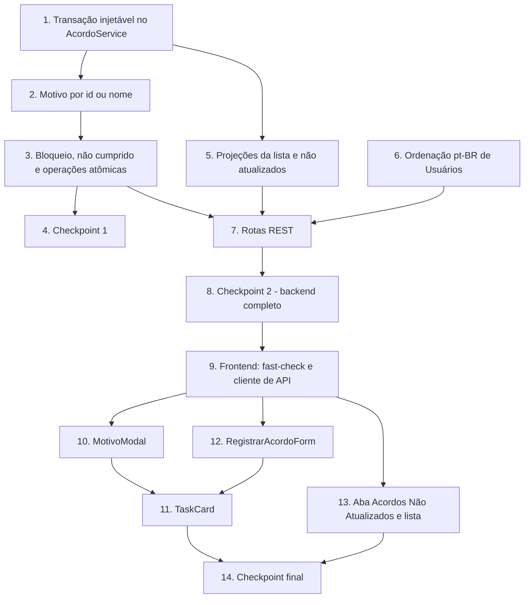

# Implementation Plan: Melhorias de Acordos

## Overview

Este plano converte o design das melhorias incrementais em uma sequência de tarefas de codificação sobre o código já existente (`backend/src/...` e `frontend/src/...`). Nenhuma migração de banco e nenhuma camada nova: cada tarefa altera um arquivo que já existe ou cria um dos três artefatos novos (`backend/src/utils/data.ts`, `frontend/src/components/MotivoModal.tsx`, `frontend/src/pages/AcordosNaoAtualizadosPage.tsx`).

A ordem é deliberadamente de dentro para fora, para que cada passo termine em estado compilável e testável:

1. **Transação injetável no `AcordoService`** — fecha o gap de atomicidade que hoje existe em `repetirUltimoAcordo` antes de qualquer novo comportamento depender dele.
2. **Resolução do Motivo_de_Nao_Cumprimento por nome** (com criação inline dentro da transação).
3. **Regras de bloqueio e de confirmação** — `marcarNaoCumprido`, bloqueio de "Avaliar e planejar", repetição atômica com motivo e `Registro_de_Acordo_com_Avaliacao`.
4. **Projeções da lista** — `mesmoDia` compartilhado, novos métodos de `TaskRepository`, novos campos do item e `obterNaoAtualizados()`.
5. **Cadastros** — ordenação alfabética pt-BR do Cadastro_de_Usuários.
6. **Rotas REST** — campos novos nos bodies, nova rota `GET /tasks/nao-atualizados` e ajuste dos testes de rota afetados.
7. **Frontend** — `MotivoModal`, `TaskCard`, `RegistrarAcordoForm`, nova página/aba, `App` e cliente de API, por último, consumindo uma API já testada.

As tarefas de ajuste dos testes já existentes (tabela "Prevenção de regressões" do design) **não** são opcionais: sem elas a suíte atual quebra. Apenas os testes novos (propriedade, unidade, integração) são marcados com `*`.

## Tasks

- [x] 1. Preparar infraestrutura de transação no `AcordoService`
  - [x] 1.1 Implementar o *transaction runner* injetável em `backend/src/services/acordoService.ts`
    - Declarar `TransactionRunner` e adicionar ao construtor um runner opcional cujo padrão usa `prisma.$transaction` de `backend/src/db/prismaClient.ts`
    - Implementar `comCliente(client)` devolvendo uma nova instância de `AcordoService` com `new TaskRepository(client)`, `new AcordoRepository(client)` e os `CadastroRepository` ligados ao mesmo client, preservando `clock` e demais dependências (os repositórios já aceitam o client por construtor — nenhum deles muda)
    - Implementar `runTransaction(fn)` privado, usado pelos métodos compostos nas tarefas seguintes; exceções dentro do callback devem propagar sem tradução, deixando o `errorHandler` existente responder no formato atual
    - _Requirements: 10.5, 10.6_
  - [x] 1.2 Injetar o runner *passthrough* nos testes existentes de `backend/src/services/acordoService.test.ts`
    - Construir o serviço dos testes com `(fn) => fn(svc)`, mantendo os repositórios fake em memória e a suíte atual verde sem tocar em nenhuma asserção de comportamento
    - _Requirements: 10.1_

- [x] 2. Implementar a resolução do Motivo_de_Nao_Cumprimento por id ou por nome
  - [x] 2.1 Implementar `MotivoInput` e `resolverMotivo` em `backend/src/services/acordoService.ts`
    - Regras: `motivoId` existente → usa o id; `motivoId` inexistente → `ValidationError MOTIVO_NAO_CUMPRIMENTO_INVALIDO`; nome com trim de 0 caracteres → `null`; nome com trim > 100 → `ValidationError VALOR_EXCEDE_LIMITE`; nome coincidente case-insensitive → id existente e cadastro inalterado; nome novo de 1–100 caracteres → cria exatamente 1 valor com o texto pós-trim
    - Reaproveitar `CadastroRepository.findByNomeCaseInsensitive` de `backend/src/repositories/cadastroRepository.ts` e criar o motivo por um repositório ligado ao client transacional, para que a criação inline participe do rollback
    - Executar a resolução **antes de qualquer escrita** e, nas operações combinadas, dentro da transação; `motivoId` tem precedência sobre `motivoNome`
    - _Requirements: 3.3, 3.4, 3.5, 3.6, 3.8, 5.5, 10.7_
  - [x] 2.2 Estender `avaliarAcordoAtual(taskId, resultado, motivo?)` para aceitar `string | MotivoInput | null`
    - Manter compatibilidade com as chamadas atuais que passam um id em string
    - Associar o motivo resolvido também quando o resultado é `cumprido` (necessário para a repetição de "Avaliar e planejar" a partir da 3ª tentativa); gravar `null` quando nenhum motivo é resolvido
    - Preservar o incremento de `numTentativas` apenas em não cumprimento e a conclusão por "Finalizar"
    - _Requirements: 4.5, 2.6, 5.3_
  - [x] 2.3 Escrever teste de propriedade da resolução do motivo em `backend/src/services/acordoService.test.ts`
    - **Property 6: Resolução do motivo e idempotência da criação inline**
    - **Validates: Requirements 3.3, 3.4, 3.5, 3.6, 10.7**
    - Tag: `Feature: melhorias-acordos, Property 6`; `fast-check` com `{ numRuns: 100 }`; geradores cobrindo nomes de 0, 1 e 100 caracteres, espaços à volta, caixa mista, acentos e cadastro vazio
  - [x] 2.4 Escrever teste de propriedade do limite de comprimento do nome de motivo em `backend/src/services/acordoService.test.ts`
    - **Property 7: Nome de motivo acima do limite é rejeitado sem efeito**
    - **Validates: Requirements 3.8**
    - Tag: `Feature: melhorias-acordos, Property 7`; gerador com nomes de 101+ caracteres

- [x] 3. Implementar bloqueio, não cumprimento direto e operações combinadas atômicas
  - [x] 3.1 Implementar o bloqueio de não cumprimento para "Avaliar e planejar" em `backend/src/services/acordoService.ts`
    - Em `avaliarAcordoAtual`, quando `resultado === 'nao_cumprido'` e o `Tipo_de_Acordo.nome` do Acordo_Atual é exatamente `"Avaliar e planejar"`, rejeitar com `ConflictError ACORDO_AVALIAR_PLANEJAR_NAO_CUMPRIMENTO_BLOQUEADO` **antes** de resolver o motivo, com mensagem indicando que esses Acordos são avaliados apenas por repetição ou finalização
    - _Requirements: 5.2, 5.5_
  - [x] 3.2 Implementar `marcarNaoCumprido(taskId, motivo?)` em `backend/src/services/acordoService.ts`
    - Rejeitar com `ConflictError SEM_ACORDO_ATUAL` quando a Task não tem Acordo_Atual e com `ConflictError ACORDO_ATUAL_JA_AVALIADO` quando o Acordo_Atual não está `pendente`; `NotFoundError TASK_NAO_ENCONTRADA` para Task inexistente
    - Delegar a `avaliarAcordoAtual(taskId, 'nao_cumprido', motivo)` dentro de `runTransaction`, mantendo a exigência de estado `pendente` apenas aqui (para não regredir `repetirUltimoAcordo` e `finalizarTask`)
    - _Requirements: 3.3, 3.6, 3.11, 5.3_
  - [x] 3.3 Escrever teste de propriedade do bloqueio em `backend/src/services/acordoService.test.ts`
    - **Property 9: Não cumprimento é bloqueado para "Avaliar e planejar"**
    - **Validates: Requirements 5.2, 5.5**
    - Tag: `Feature: melhorias-acordos, Property 9`; comparar snapshot completo (Task, histórico de Acordos, cadastro de motivos) antes/depois, inclusive com nome destinado a criação inline
  - [x] 3.4 Escrever teste de propriedade das operações que exigem Acordo_Atual pendente em `backend/src/services/acordoService.test.ts`
    - **Property 10: Operações que exigem Acordo_Atual pendente são rejeitadas sem efeito**
    - **Validates: Requirements 3.11, 4.9**
    - Tag: `Feature: melhorias-acordos, Property 10`; gerador cobrindo Task sem Acordo_Atual e todos os valores de `estadoCumprimento`
  - [x] 3.5 Escrever teste de propriedade dos contadores em `backend/src/services/acordoService.test.ts`
    - **Property 8: Contadores são monotônicos e mutuamente exclusivos**
    - **Validates: Requirements 1.3, 4.6, 5.3**
    - Tag: `Feature: melhorias-acordos, Property 8`; gerador de sequências de operações com `numTentativas` em 0 e 9999
  - [x] 3.6 Tornar `repetirUltimoAcordo(taskId, motivo?)` atômico em `backend/src/services/acordoService.ts`
    - Executar validações, avaliação do Acordo_Atual e registro do novo Acordo dentro de um único `runTransaction`
    - Tipo diferente de "Avaliar e planejar": avalia `nao_cumprido` com o motivo resolvido quando houver e incrementa `numTentativas`; tipo "Avaliar e planejar": avalia `cumprido` com o motivo resolvido quando houver, incrementa `tentativasAvaliarPlanejar` e mantém `numTentativas`
    - Registrar o novo Acordo com o mesmo `tipoAcordoId` e sem `responsavelId`, preservando o Responsável atual; o backend nunca exige `motivo`
    - _Requirements: 4.2, 4.5, 4.6, 4.8, 4.9_
  - [x] 3.7 Escrever teste de propriedade da repetição em `backend/src/services/acordoService.test.ts`
    - **Property 11: Repetição do último Acordo é uma operação única e completa**
    - **Validates: Requirements 4.2, 4.3, 4.5**
    - Tag: `Feature: melhorias-acordos, Property 11`
  - [x] 3.8 Implementar o `Registro_de_Acordo_com_Avaliacao` em `registrarAcordo` (`backend/src/services/acordoService.ts`)
    - Adicionar `confirmaCumprimentoAcordoAtual?: boolean` a `RegistrarAcordoOptions`
    - Acordo_Atual `pendente` sem confirmação → `ValidationError CONFIRMACAO_CUMPRIMENTO_OBRIGATORIA` (substitui o atual `ConflictError ACORDO_ATUAL_PENDENTE` nesse caso), com mensagem indicando que o não cumprimento deve ser registrado pela ação "Marcar como não cumprido"
    - Acordo_Atual `pendente` com confirmação → transação única que avalia `cumprido` e registra o novo Acordo, sem alterar `numTentativas`; quando o Tipo_de_Acordo do Acordo_Atual é `"Finalizar"`, marcar `Task.concluida = true` e **não** registrar novo Acordo
    - Acordo_Atual ausente ou já avaliado → caminho atual inalterado, ignorando a confirmação quando enviada; manter a cadeia de `tentativasAvaliarPlanejar` como já implementada
    - _Requirements: 8.2, 8.3, 8.4, 8.7, 8.9, 8.10, 8.11, 9.2, 9.3, 9.8, 9.9_
  - [x] 3.9 Escrever teste de propriedade do registro com avaliação embutida em `backend/src/services/acordoService.test.ts`
    - **Property 14: Registro de Acordo com avaliação embutida**
    - **Validates: Requirements 8.2, 8.4, 8.7**
    - Tag: `Feature: melhorias-acordos, Property 14`
  - [x] 3.10 Escrever teste de propriedade da confirmação obrigatória em `backend/src/services/acordoService.test.ts`
    - **Property 15: Confirmação de cumprimento é obrigatória com Acordo_Atual pendente**
    - **Validates: Requirements 8.11**
    - Tag: `Feature: melhorias-acordos, Property 15`
  - [x] 3.11 Escrever teste de propriedade da cadeia de "Avaliar e planejar" em `backend/src/services/acordoService.test.ts`
    - **Property 17: Cadeia de ciclos de "Avaliar e planejar"**
    - **Validates: Requirements 8.9, 8.10**
    - Tag: `Feature: melhorias-acordos, Property 17`; gerador de sequências de registros com tipos e estados variados
  - [x] 3.12 Escrever teste de propriedade da atualização condicional do Responsável em `backend/src/services/acordoService.test.ts`
    - **Property 24: Atualização condicional do Responsável no registro de Acordo**
    - **Validates: Requirements 9.2, 9.3, 9.8, 9.9**
    - Tag: `Feature: melhorias-acordos, Property 24`
  - [x] 3.13 Escrever teste de propriedade de atomicidade em `backend/src/services/acordoService.test.ts`
    - **Property 13: Atomicidade — rejeição implica estado inalterado**
    - **Validates: Requirements 3.9, 4.8, 8.5, 10.5**
    - Tag: `Feature: melhorias-acordos, Property 13`; o gerador escolhe a etapa que falha (Tipo_de_Acordo inválido, Responsável inválido, motivo acima do limite, falha injetada no `create`/`update` do repositório fake) e o teste compara snapshot completo do estado antes/depois
  - [x] 3.14 Ajustar os testes existentes de `backend/src/services/acordoService.test.ts`
    - Os testes que registram novo Acordo sobre Acordo_Atual **pendente** passam a esperar `ValidationError CONFIRMACAO_CUMPRIMENTO_OBRIGATORIA` sem confirmação e sucesso com confirmação
    - Ajustar os testes de `repetirUltimoAcordo` para a nova assinatura com motivo opcional
    - _Requirements: 4.2, 8.2, 8.11, 10.1_

- [x] 4. Checkpoint 1 — Garantir que todos os testes do `AcordoService` passam, perguntar ao usuário se houver dúvidas.

- [x] 5. Implementar as projeções da Lista_de_Acordos e a Lista_de_Acordos_Nao_Atualizados
  - [x] 5.1 Extrair `mesmoDia` para `backend/src/utils/data.ts` e reaproveitá-la em `backend/src/services/atividadesFinalizadasService.ts`
    - Manter a comparação por ano/mês/dia no fuso do servidor, removendo a definição local do `AtividadesFinalizadasService` e importando a compartilhada, sem alterar comportamento nem asserções de `atividadesFinalizadasService.test.ts`
    - _Requirements: 7.3, 10.1_
  - [x] 5.2 Adicionar os dois métodos de listagem em `backend/src/repositories/taskRepository.ts`
    - `listActiveWithAcordoAtualResponsavelEUltimoMotivo()`: `include` de `acordoAtual.tipoAcordo`, `responsavel` e `acordos` filtrado por `motivoNaoCumprimentoId: { not: null }`, com `motivoNaoCumprimento`, `orderBy: [{ dataRegistro: 'desc' }, { id: 'desc' }]` e `take: 1`
    - `listActiveWithUltimoAcordoEResponsavel()`: mesmo formato, com `acordos` sem filtro de motivo (`take: 1`, desc)
    - Não alterar nem remover `listActiveWithAcordoAtualEResponsavel`, preservando os testes que já a usam
    - _Requirements: 2.3, 7.3, 10.1_
  - [x] 5.3 Estender os itens da Lista_de_Acordos em `backend/src/services/listaDeAcordosService.ts`
    - Adicionar `responsavelId?`, `estadoCumprimentoAcordoAtual` e `ultimoMotivoNome?` a `TaskComAcordoItem` e `responsavelId?` a `TaskNovaItem`, consumindo `listActiveWithAcordoAtualResponsavelEUltimoMotivo`
    - Derivar `ultimoMotivoNome` de `acordos[0]?.motivoNaoCumprimento?.nome`, omitindo o campo quando ausente; preservar todos os campos atuais com o mesmo nome e semântica (`alerta`, `numTentativas`, `alertaTentativasAvaliarPlanejar`, `tentativasAvaliarPlanejar`)
    - _Requirements: 1.1, 2.1, 2.3, 2.4, 2.5, 2.6, 8.1, 9.5, 10.9_
  - [x] 5.4 Escrever teste de propriedade da derivação do último motivo em `backend/src/services/listaDeAcordosService.test.ts`
    - **Property 3: Derivação do Ultimo_Motivo_Informado**
    - **Validates: Requirements 2.3, 2.4, 2.5, 2.6**
    - Tag: `Feature: melhorias-acordos, Property 3`; gerador com históricos de `dataRegistro` repetida, Acordos sem motivo e todos os valores de `estadoCumprimento`
  - [x] 5.5 Escrever teste de propriedade da completude do item da lista em `backend/src/services/listaDeAcordosService.test.ts`
    - **Property 4: O item da Lista_de_Acordos carrega todos os valores exibidos**
    - **Validates: Requirements 9.5, 10.9**
    - Tag: `Feature: melhorias-acordos, Property 4`
  - [x] 5.6 Implementar `obterNaoAtualizados()` em `backend/src/services/listaDeAcordosService.ts`
    - Declarar `TaskNaoAtualizadaItem` (`dataUltimaAtualizacaoAcordo?`, `tipoAcordoNome?`, `responsavelId?`, `responsavelNome?`, `ordemExibicao`) e injetar um `Clock` no serviço, seguindo o padrão de `AtividadesFinalizadasService`
    - Consumir `listActiveWithUltimoAcordoEResponsavel`, incluir a Task quando não há Acordo **ou** quando `!mesmoDia(dataUltimaAtualizacaoAcordo, clock())`, independentemente do estado de cumprimento, ordenar por `ordemExibicao` crescente e retornar a lista completa sem paginação
    - _Requirements: 7.3, 7.4, 7.5, 7.6, 7.7, 7.10_
  - [x] 5.7 Escrever teste de propriedade da partição da lista de não atualizados em `backend/src/services/listaDeAcordosService.test.ts`
    - **Property 21: Partição exata da Lista_de_Acordos_Nao_Atualizados**
    - **Validates: Requirements 7.3, 7.4, 7.5, 7.7, 7.9**
    - Tag: `Feature: melhorias-acordos, Property 21`; clock fixo e gerador com Acordos às 00:00 e 23:59 do dia atual, em dias adjacentes, sem Acordo e Tasks concluídas misturadas às ativas
  - [x] 5.8 Adaptar os testes existentes de `backend/src/services/listaDeAcordosService.test.ts`
    - Atualizar o fake de `TaskRepository` para expor os novos métodos com `acordos` incluídos e estender as asserções aos novos campos do item
    - _Requirements: 2.3, 9.5, 10.1_

- [x] 6. Implementar a ordenação alfabética pt-BR do Cadastro_de_Usuários
  - [x] 6.1 Adicionar o comparador opcional em `backend/src/services/cadastroService.ts`
    - Incluir `comparar?: (a: TModel, b: TModel) => number` em `CadastroServiceOptions` (parametrizando-a também pelo tipo do modelo) e aplicá-lo em `listar()`; sem comparador, preservar a ordem atual do banco
    - Configurar o comparador **somente** em `usuarioCadastradoService`, com `new Intl.Collator('pt-BR', { sensitivity: 'base', usage: 'sort' })` sobre `nomeLogin` e desempate crescente por `id`, mantendo `tipoAcordoService` e `motivoNaoCumprimentoService` inalterados
    - _Requirements: 6.1, 6.2, 6.4, 6.5, 10.7_
  - [x] 6.2 Escrever teste de propriedade da ordenação em `backend/src/services/cadastroService.test.ts`
    - **Property 19: Ordenação total e determinística do Cadastro_de_Usuários**
    - **Validates: Requirements 6.1, 6.2, 6.4, 6.5**
    - Tag: `Feature: melhorias-acordos, Property 19`; gerador com acentos, caixa mista, prefixos numéricos, nomes equivalentes e cadastro vazio/unitário
  - [x] 6.3 Escrever testes-âncora de collation em `backend/src/services/cadastroService.test.ts`
    - "Ávila" antes de "Bruno", "Água" antes de "Alberto", "1-teste" antes de "Alberto"
    - _Requirements: 6.1_

- [x] 7. Expor as melhorias nas rotas REST
  - [x] 7.1 Alterar as rotas de Acordo em `backend/src/routes/taskRoutes.ts`
    - `POST /tasks/:id/acordos`: aceitar `confirmaCumprimentoAcordoAtual?: boolean` no body, respondendo `201` com o novo Acordo no caso geral e `200` com o Acordo avaliado quando a confirmação concluiu uma Task de Acordo_Atual "Finalizar"
    - `PATCH /tasks/:id/acordos/atual`: aceitar `motivoNome?: string` além do `motivoId?` e, com `resultado: 'nao_cumprido'`, delegar a `marcarNaoCumprido`
    - `POST /tasks/:id/acordos/repetir`: aceitar body opcional `{ motivoId?, motivoNome? }` e repassá-lo ao serviço
    - _Requirements: 3.3, 3.4, 3.5, 3.6, 3.8, 3.11, 4.2, 4.5, 5.2, 8.2, 8.7, 8.11, 9.9, 10.6_
  - [x] 7.2 Implementar `GET /tasks/nao-atualizados` em `backend/src/routes/taskRoutes.ts`
    - Registrar o segmento literal antes das rotas `/:id`, como já é feito com `/finalizadas`, delegando a `ListaDeAcordosService.obterNaoAtualizados()` e serializando as datas em ISO 8601
    - _Requirements: 7.2, 7.3, 7.4, 7.5, 7.6, 7.7, 7.10_
  - [x] 7.3 Ajustar e ampliar `backend/src/routes/taskRoutes.test.ts`
    - Trocar a expectativa de `409` por `400` com `CONFIRMACAO_CUMPRIMENTO_OBRIGATORIA` no `POST /tasks/:id/acordos` com Acordo_Atual pendente, e cobrir o sucesso com confirmação
    - Adicionar 1–3 exemplos por rota nova/alterada: `PATCH /tasks/:id/acordos/atual` com `motivoNome` (criação inline e coincidência case-insensitive), bloqueio de "Avaliar e planejar" (`409`), `POST /tasks/:id/acordos/repetir` com motivo, `GET /tasks/nao-atualizados` e os novos campos de `GET /tasks`, sempre verificando o corpo `{ erro: { codigo, mensagem } }` nos casos de erro
    - _Requirements: 3.3, 5.2, 7.3, 8.11, 10.6_
  - [x] 7.4 Ajustar `backend/src/routes/smokeE2E.test.ts`
    - Substituir o passo de avaliação via `PATCH /tasks/:id/acordos/atual` com `cumprido` pelo `Registro_de_Acordo_com_Avaliacao` (`POST /tasks/:id/acordos` com `confirmaCumprimentoAcordoAtual: true`), refletindo o fluxo real da nova interface
    - _Requirements: 8.2, 8.6, 10.1_
  - [x] 7.5 Adicionar asserção de ordem em `GET /usuarios` em `backend/src/routes/cadastroRoutes.test.ts`
    - Semear nomes com acentos e caixa mista e verificar a sequência retornada; manter inalteradas as asserções de tipos de acordo e de motivos
    - _Requirements: 6.1, 10.7_
  - [x] 7.6 Escrever teste de integração de atomicidade com Prisma/SQLite real
    - Novo arquivo `backend/src/routes/acordosAtomicidade.test.ts`, seguindo o bootstrap de banco isolado já usado em `taskRoutes.test.ts` (`prisma migrate deploy` em diretório temporário)
    - Cobrir o rollback real de `POST /tasks/:id/acordos` com confirmação e de `POST /tasks/:id/acordos/repetir` quando a segunda etapa falha, incluindo a **não persistência** do motivo criado inline — o runner passthrough dos testes de unidade não exercita a transação
    - Cobrir também `GET /tasks/nao-atualizados` com Acordos registrados hoje e em dias anteriores usando clock controlado
    - _Requirements: 4.8, 5.5, 7.3, 8.5, 10.5_

- [x] 8. Checkpoint 2 — Garantir que todos os testes do backend passam, perguntar ao usuário se houver dúvidas.

- [x] 9. Preparar o frontend: dependência de teste e cliente de API
  - [x] 9.1 Adicionar `fast-check` 3.22.0 como devDependency em `frontend/package.json`
    - Única dependência nova de toda a entrega; instalar e confirmar que `npm test` (vitest run) continua executando
    - _Requirements: N/A (infraestrutura de teste)_
  - [x] 9.2 Estender `frontend/src/api/types.ts` e `frontend/src/api/client.ts`
    - Tipos: `responsavelId?` em `TaskNovaItem`/`TaskComAcordoItem`, `estadoCumprimentoAcordoAtual` e `ultimoMotivoNome?` em `TaskComAcordoItem`, novo `TaskNaoAtualizadaItem`, `motivoNome?` em `AvaliarAcordoAtualInput`, `confirmaCumprimentoAcordoAtual?` em `RegistrarAcordoInput`
    - Cliente: `repetirUltimoAcordo(taskId, input?)` com `{ motivoId?, motivoNome? }`, nova função `obterAcordosNaoAtualizados()` para `GET /tasks/nao-atualizados`, e timeouts via `AbortController` no wrapper de `frontend/src/api/http.ts` (30 s nas operações de Acordo, 3 s na lista de não atualizados, 10 s no recarregamento da lista), traduzidos para `ApiError` de falha de comunicação
    - _Requirements: 3.9, 7.2, 7.11, 8.2, 9.5, 10.6, 10.10_
  - [x] 9.3 Estender `frontend/src/api/client.test.ts`
    - Cobrir as novas funções/campos com `fetch` mockado, incluindo resposta de erro e timeout traduzido em rejeição
    - _Requirements: 3.9, 7.11, 10.10_

- [x] 10. Implementar o Modal_de_Motivo
  - [x] 10.1 Criar `frontend/src/components/MotivoModal.tsx` e `MotivoModal.css`
    - `role="dialog"`, `aria-modal="true"`, foco inicial no Combobox_de_Motivo, `Esc` cancela; sobreposto à Lista_de_Acordos
    - Combobox_de_Motivo como um único `<input list="...">` com `<datalist>` alimentado por `listarMotivos()`, aceitando digitação de nome novo inclusive com cadastro vazio
    - Props `titulo`, `onConfirmar(motivoNome: string): Promise<void>`, `onCancelar()`; submete sempre `motivoNome` (sem trim no cliente); desabilita confirmação e cancelamento enquanto a promessa está pendente; em rejeição mantém aberto, exibe a mensagem da API dentro do modal e preserva o texto digitado
    - _Requirements: 3.1, 3.2, 3.7, 3.8, 3.9, 3.10, 4.7, 4.8, 4.10, 10.4_
  - [x] 10.2 Escrever teste de propriedade do Combobox_de_Motivo em `frontend/src/components/MotivoModal.test.tsx`
    - **Property 5: O Combobox_de_Motivo oferece exatamente o cadastro**
    - **Validates: Requirements 3.2**
    - Tag: `Feature: melhorias-acordos, Property 5`; `fast-check` + `@testing-library/react` com `../api/client` mockado, cadastros vazio, unitário e grande
  - [x] 10.3 Escrever testes de unidade do `MotivoModal` em `frontend/src/components/MotivoModal.test.tsx`
    - Abrir com campo limpo e sem requisição; cancelar sem requisição; duplo-clique com promessa pendente resultando em uma única submissão; rejeição da API preservando o texto; timeout de 30 s tratado como rejeição
    - _Requirements: 3.1, 3.7, 3.9, 3.10, 4.7, 4.10_

- [x] 11. Reformular o `TaskCard`
  - [x] 11.1 Alterar `frontend/src/components/TaskCard.tsx` (e `TaskCard.css` quando necessário)
    - Exibir, na ordem: "Registrado em" → "Nº de tentativas" (`numTentativas`, sempre, inclusive zero, só para Task_Com_Acordo) → "Último motivo informado" (`ultimoMotivoNome`, com rótulo omitido quando ausente)
    - Textos de alerta sem contador: "Alerta: Acordo não cumprido" e "Alerta: número de tentativas de 'Avaliar e planejar' alto"
    - Remover o botão "Avaliar" e o uso do `AvaliarAcordoForm`; adicionar a ação "Marcar como não cumprido" abrindo o `MotivoModal` e submetendo `PATCH /tasks/:id/acordos/atual` com `resultado: 'nao_cumprido'` e `motivoNome`
    - Manter "Marcar como não cumprido" visível e desabilitada (`disabled` + `aria-disabled` + `title`) quando `tipoAcordoNome === 'Avaliar e planejar'`, e habilitada nos outros tipos
    - "Repetir último acordo" abre o `MotivoModal` quando o tipo é diferente de "Avaliar e planejar" ou quando `tentativasAvaliarPlanejar >= 2`; caso contrário chama a API direto
    - Um único estado `operacaoEmAndamento` desabilita todas as ações do card enquanto qualquer operação está pendente; após sucesso, fechar modal/painel e chamar `onAcordoAlterado()`
    - Passar `estadoCumprimentoAcordoAtual` e `responsavelIdAtual` ao `RegistrarAcordoForm`, e usar `responsavelId` do item (em lugar do casamento por `nomeLogin`) na edição de Task
    - _Requirements: 1.1, 1.2, 1.4, 1.5, 1.6, 1.7, 2.1, 2.2, 2.7, 3.1, 4.1, 4.3, 4.4, 4.11, 5.1, 5.4, 5.6, 8.6, 9.6, 10.11_
  - [x] 11.2 Remover `frontend/src/components/AvaliarAcordoForm.tsx`, `AvaliarAcordoForm.css` e `AvaliarAcordoForm.test.tsx`
    - O fluxo do botão "Avaliar" deixa de existir; garantir que nenhum import remanescente aponte para esses arquivos
    - _Requirements: 8.6_
  - [x] 11.3 Escrever teste de propriedade da renderização do card em `frontend/src/components/TaskCard.test.tsx`
    - **Property 1: Renderização do Card_de_Task é fiel ao item recebido**
    - **Validates: Requirements 1.1, 1.2, 1.7, 2.1, 2.2, 2.7, 10.3**
    - Tag: `Feature: melhorias-acordos, Property 1`; geradores com `numTentativas` em 0 e 9999 e nomes de motivo de 1 a 100 caracteres
  - [x] 11.4 Escrever teste de propriedade das mensagens de alerta em `frontend/src/components/TaskCard.test.tsx`
    - **Property 2: Mensagens de alerta não contêm contadores**
    - **Validates: Requirements 1.4, 1.5, 1.6**
    - Tag: `Feature: melhorias-acordos, Property 2`
  - [x] 11.5 Escrever teste de propriedade da disponibilidade das ações em `frontend/src/components/TaskCard.test.tsx`
    - **Property 18: Disponibilidade das ações do Card_de_Task**
    - **Validates: Requirements 5.1, 5.4, 5.6, 8.6**
    - Tag: `Feature: melhorias-acordos, Property 18`
  - [x] 11.6 Escrever teste de propriedade da decisão do modal na repetição em `frontend/src/components/TaskCard.test.tsx`
    - **Property 12: Decisão de apresentar o Modal_de_Motivo na repetição**
    - **Validates: Requirements 4.1, 4.4**
    - Tag: `Feature: melhorias-acordos, Property 12`; gerador variando `tipoAcordoNome` e `tentativasAvaliarPlanejar` (inclusive 0, 1, 2 e valores altos)
  - [x] 11.7 Ajustar os testes existentes de `frontend/src/components/TaskCard.test.tsx`
    - Atualizar as asserções de texto dos alertas (hoje esperam o contador na mensagem), remover qualquer expectativa do botão "Avaliar" e estender as fixtures com os novos campos do item
    - _Requirements: 1.4, 1.5, 8.6, 10.1_

- [x] 12. Ajustar o `RegistrarAcordoForm`
  - [x] 12.1 Alterar `frontend/src/components/RegistrarAcordoForm.tsx`
    - Novas props `estadoCumprimentoAcordoAtual?` e `responsavelIdAtual?`; com Acordo_Atual `pendente`, exibir checkbox obrigatório "O acordo atual foi cumprido", habilitar o submit só com ele marcado e enviar `confirmaCumprimentoAcordoAtual: true`; nos demais casos, não exibir o campo
    - Seletor_de_Responsavel iniciando com `responsavelIdAtual` quando o id existe na lista de `GET /usuarios`, e vazio quando não há Responsável ou o id não pertence ao cadastro; submeter sem `responsavelId` quando a seleção está vazia
    - Renderizar os Usuários exatamente na ordem recebida do servidor; falha no carregamento exibe erro e deixa o seletor sem opções; erro da API mantém o formulário aberto com todos os valores preservados
    - _Requirements: 6.3, 6.7, 6.8, 8.1, 8.2, 8.3, 8.4, 8.5, 9.1, 9.3, 9.4, 9.7, 9.8, 9.9, 10.4_
  - [x] 12.2 Escrever teste de propriedade da forma do formulário em `frontend/src/components/RegistrarAcordoForm.test.tsx`
    - **Property 16: Forma do formulário de registro depende do estado do Acordo_Atual**
    - **Validates: Requirements 8.1, 8.3**
    - Tag: `Feature: melhorias-acordos, Property 16`
  - [x] 12.3 Escrever teste de propriedade da pré-seleção do Responsável em `frontend/src/components/RegistrarAcordoForm.test.tsx`
    - **Property 23: Pré-seleção do Responsável nos formulários**
    - **Validates: Requirements 9.1, 9.4, 9.6, 9.7**
    - Tag: `Feature: melhorias-acordos, Property 23`; cobrir também o formulário de edição de Task
  - [x] 12.4 Escrever teste de propriedade da preservação da ordem recebida do servidor
    - **Property 20: O cliente preserva a ordem recebida do servidor**
    - **Validates: Requirements 6.3, 6.6, 6.7**
    - Tag: `Feature: melhorias-acordos, Property 20`; exercitar o Seletor_de_Responsavel (`RegistrarAcordoForm.test.tsx`) e a listagem de Usuários da Administração de Cadastros (`frontend/src/components/CadastroSection.test.tsx`), incluindo a sequência vazia
  - [x] 12.5 Escrever testes de unidade do formulário em `frontend/src/components/RegistrarAcordoForm.test.tsx`
    - Submissão sem confirmação rejeitada pela API mantendo os valores; erro de Responsável não cadastrado; falha ao carregar Usuários
    - _Requirements: 6.8, 8.5, 8.11, 9.9, 10.4_

- [x] 13. Implementar a aba "Acordos Não Atualizados" e integrar a lista
  - [x] 13.1 Criar `frontend/src/pages/AcordosNaoAtualizadosPage.tsx` e `AcordosNaoAtualizadosPage.css`
    - Consumir `obterAcordosNaoAtualizados()` com indicação de carregamento; em falha ou timeout de 3 s, encerrar o carregamento, exibir erro e oferecer "Tentar novamente"
    - Cada item exibe título, Responsável (quando houver), data em dd/mm/aaaa (quando houver) e Tipo_de_Acordo do Acordo_Atual (quando houver); Tasks sem Acordo exibem "Sem Acordo registrado" no lugar da data e do tipo
    - Lista vazia exibe "Todas as Tasks ativas possuem Acordo registrado hoje" e nenhum item; os dados são recarregados a cada montagem da página, como em `AtividadesFinalizadasPage`
    - _Requirements: 7.2, 7.6, 7.8, 7.9, 7.10, 7.11, 10.8_
  - [x] 13.2 Escrever teste de propriedade da renderização do item em `frontend/src/pages/AcordosNaoAtualizadosPage.test.tsx`
    - **Property 22: Renderização do item de Acordo Não Atualizado**
    - **Validates: Requirements 7.6, 7.10**
    - Tag: `Feature: melhorias-acordos, Property 22`; gerador combinando presença/ausência de Responsável, data e tipo
  - [x] 13.3 Escrever testes de unidade da página em `frontend/src/pages/AcordosNaoAtualizadosPage.test.tsx`
    - Estado de carregamento, lista vazia com a indicação de tudo atualizado, falha e timeout com ação de nova tentativa, recarregamento a cada seleção da aba
    - _Requirements: 7.2, 7.8, 7.11, 10.8_
  - [x] 13.4 Adicionar a Aba_Acordos_Nao_Atualizados em `frontend/src/App.tsx`
    - Novo valor `'nao-atualizados'` no tipo `Pagina` e botão rotulado "Acordos Não Atualizados" posicionado entre "Lista de Acordos" e "Atividades Finalizadas", com `data-testid` no mesmo padrão dos existentes e sem alterar a posição relativa das demais abas
    - _Requirements: 7.1, 10.8_
  - [x] 13.5 Ajustar `frontend/src/App.test.tsx`
    - Incluir a nova aba na verificação da navegação principal (rótulo, posição e troca de página)
    - _Requirements: 7.1, 10.1_
  - [x] 13.6 Ajustar `frontend/src/pages/ListaDeAcordosPage.tsx`
    - Repassar os novos campos do item ao `TaskCard`, exibir mensagem de erro quando a consulta inicial da lista falha (mantendo os valores do último carregamento bem-sucedido) e, quando o recarregamento após uma operação aceita falha ou excede 10 s, exibir erro com ação de repetir sem desfazer a operação persistida
    - _Requirements: 1.8, 10.3, 10.10_
  - [x] 13.7 Ajustar `frontend/src/pages/ListaDeAcordosPage.test.tsx`
    - Estender as fixtures de item com `estadoCumprimentoAcordoAtual`, `responsavelId` e `ultimoMotivoNome`, e cobrir a falha de carregamento e de recarregamento
    - _Requirements: 1.8, 2.1, 8.1, 9.5, 10.1, 10.10_

- [x] 14. Checkpoint final — Garantir que todos os testes (backend e frontend) passam, perguntar ao usuário se houver dúvidas.

## Notes

- Tarefas marcadas com `*` são testes novos (propriedade, unidade, integração) e podem ser puladas para um MVP mais rápido. As tarefas de **ajuste dos testes existentes** (1.2, 3.14, 5.8, 7.3, 7.4, 7.5, 11.2, 11.7, 13.5, 13.7) **não** são opcionais: sem elas a suíte atual quebra, e é o Requisito 10 que exige mantê-la válida.
- Cada teste de propriedade referencia exatamente uma das 24 Correctness Properties do design, usa `fast-check` com no mínimo 100 iterações e é identificado pela tag `Feature: melhorias-acordos, Property {número}`.
- As properties de backend rodam sobre os serviços com repositórios fake em memória e o *transaction runner* passthrough; as de frontend rodam sobre os componentes com `../api/client` mockado. O rollback real só é exercitado pela tarefa 7.6, com Prisma/SQLite.
- Nenhuma migração de banco é criada: `backend/prisma/schema.prisma` permanece intacto.
- `fast-check` no frontend (tarefa 9.1) é a única dependência nova de toda a entrega.
- Os três checkpoints validam, em ordem, o `AcordoService`, o backend completo e a entrega inteira.

## Task Dependency Graph



```json
{
  "waves": [
    { "id": 0, "tasks": ["1.1", "5.1", "6.1", "9.1"] },
    { "id": 1, "tasks": ["1.2", "5.2", "6.2"] },
    { "id": 2, "tasks": ["2.1", "5.3", "6.3"] },
    { "id": 3, "tasks": ["2.2", "5.4"] },
    { "id": 4, "tasks": ["2.3", "5.5"] },
    { "id": 5, "tasks": ["2.4", "5.6"] },
    { "id": 6, "tasks": ["3.1", "5.7"] },
    { "id": 7, "tasks": ["3.2", "5.8"] },
    { "id": 8, "tasks": ["3.3"] },
    { "id": 9, "tasks": ["3.4"] },
    { "id": 10, "tasks": ["3.5"] },
    { "id": 11, "tasks": ["3.6"] },
    { "id": 12, "tasks": ["3.7"] },
    { "id": 13, "tasks": ["3.8"] },
    { "id": 14, "tasks": ["3.9"] },
    { "id": 15, "tasks": ["3.10"] },
    { "id": 16, "tasks": ["3.11"] },
    { "id": 17, "tasks": ["3.12"] },
    { "id": 18, "tasks": ["3.13"] },
    { "id": 19, "tasks": ["3.14"] },
    { "id": 20, "tasks": ["7.1"] },
    { "id": 21, "tasks": ["7.2"] },
    { "id": 22, "tasks": ["7.3", "7.4", "7.5", "7.6", "9.2"] },
    { "id": 23, "tasks": ["9.3", "10.1"] },
    { "id": 24, "tasks": ["10.2", "11.1", "12.1", "13.1"] },
    { "id": 25, "tasks": ["10.3", "11.2", "11.3", "12.2", "13.2", "13.4"] },
    { "id": 26, "tasks": ["11.4", "12.3", "13.3", "13.5", "13.6"] },
    { "id": 27, "tasks": ["11.5", "12.4", "13.7"] },
    { "id": 28, "tasks": ["11.6", "12.5"] },
    { "id": 29, "tasks": ["11.7"] }
  ]
}
```
